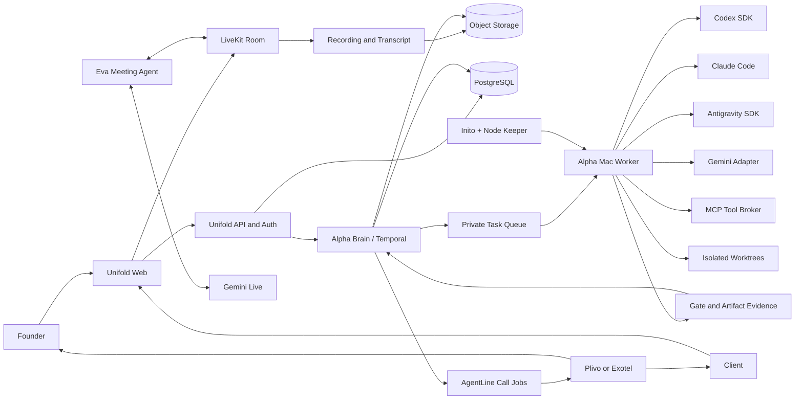

<!-- markdownlint-disable MD013 -->

# Alpha Brain: System Analysis, Architecture, and Implementation Plan

Date: 24 August 2026  
Scope: planning and research only; no product source files changed

## 1. Executive decision

Build Alpha Brain as a fourth system. Do not merge Unifold, AgentLine, and Inito into one codebase.

- **Unifold** owns client intake, meetings, Eva, specifications, client portal, and project experience.
- **Alpha Brain** owns durable workflows, task routing, approvals, evidence, agent execution policy, and project state.
- **AgentLine** owns phone calls and voice notifications through Kavya or Eva.
- **Inito** owns local privacy protection. Add a separate **Node Keeper** module for Mac worker health, launch persistence, power policy, and safe unattended operation.
- **Alpha Mac Worker** executes approved development jobs through supported Codex, Claude Code, Antigravity, and Gemini interfaces.

Use hybrid architecture:

- Public meeting, portal, workflow, and event services run in cloud.
- Mac connects outbound to Alpha Brain. No public inbound port reaches Mac.
- Code work happens in isolated per-task worktrees on Mac initially.
- Cloud plane remains available if Mac sleeps, loses power, or disconnects. Work pauses or requeues truthfully.

Do not promise “any large project, bug-free, in one night.” System can shorten delivery cycles and run continuously, but completion depends on scope, external approvals, APIs, model limits, test coverage, and hardware capacity.

## 2. Current implementation: verified findings

### 2.1 Unifold

Useful foundation exists:

- FastAPI meeting prototype and browser UI.
- Eva chat endpoint and SDLC dossier generation.
- SDLC supervisor with build/verify/fix loop.
- Antigravity discovery and dispatch experiments.
- JSON-based task, memory, and company-bus prototypes.
- AgentLine call trigger.

Major gaps:

| Area | Current behavior | Production gap |
|---|---|---|
| Meeting media | Browser captures local microphone. WebSocket synchronizes shared UI state. | No peer media connection, signaling, remote participant tracks, room isolation, TURN, or real screen-share publication. It is not yet a Google Meet-like room. |
| Eva voice | `/api/speak` sends text to regular Gemini content generation. | Not Gemini Live duplex audio. No interruption handling, session resumption, audio transcription, or per-room agent session. |
| Meeting state | One in-memory manager and shared WebSocket list. | No tenant isolation, durable rooms, reconnect state, or authenticated roles. |
| Documentation | Regex and templates produce dossier files. | No semantic requirement model, decision provenance, versioned spec, acceptance review, or client sign-off. |
| SDLC gates | Supervisor can execute shell acceptance commands; fallback gates are shallow. | No sandbox, strict command policy, typed evidence manifest, independent review, or reliable deployment proof. |
| Antigravity bridge | Scrapes private Antigravity processes, ports, CSRF data, and transcript state. Quiet period can mean completion. | Fragile private integration. Completion is not reliable. Replace with supported SDK/CLI contract. |
| Deployment | Manager builds commands and guesses URLs/status. | It does not prove deployment occurred. Needs provider result, endpoint smoke test, browser check, and rollback metadata. |
| MCP bridge | Builds request payloads for GitHub, Stitch, and MongoDB. | Does not invoke real MCP operations. |
| Company bus | JSON messages plus several hard-coded simulated business actions. | No durable event broker, policy engine, identity, or auditable side effects. |
| Calls | Plivo request can start a call. | Project message is not delivered into AgentLine pipeline; completion evidence is hard-coded. |

Security-critical finding: live-looking Plivo credentials are present in Unifold source. Rotate them immediately, move replacements to a secret manager, and remove exposed values from repository history. Do not wait for Alpha Brain development.

Relevant code evidence:

- `unifold_meet/server/app.py`: wildcard CORS, unauthenticated APIs/WebSocket, shared global state, and hard-coded completion claims.
- `unifold_meet/frontend/js/webrtc_client.js`: local media only; no `RTCPeerConnection`, signaling, remote tracks, or published screen share.
- `unifold_meet/server/eva_voice_agent.py`: normal Gemini `generate_content`, not Gemini Live.
- `unifold/core/intake_extractor.py`: rule-based extraction and template files.
- `unifold/core/sdlc_supervisor.py`: real loop structure, but arbitrary shell acceptance commands and shallow fallbacks.
- `unifold/tools/antigravity_live_bridge.py`: private process and language-server inspection.
- `unifold/tools/deployment_manager.py`: command/URL plans, not deployments.
- `unifold/tools/mcp_bridge.py`: request payload construction, not MCP execution.
- `unifold_calls/caller.py`: credential exposure and dropped call message.

Verification result:

- Intended `.venv` test run executed 61 tests; 2 failed.
- One failure depended on unavailable local MLX service.
- Self-modification safety test failed; claimed rollback is not implemented.
- Tests caused external side effects, including starting a temporary HTTP server and opening a browser. Current suite is not isolated.
- README test count is stale.

### 2.2 AgentLine

Useful foundation exists:

- Real Plivo bidirectional WebSocket audio path.
- Real Gemini Live session with streaming audio, barge-in, transcription events, and tool calls.
- MongoDB lead, conversation, and callback storage.
- Plivo and Exotel routes.
- Kavya and Eva prompt definitions.
- Post-call CRM/email workflows.

Major gaps:

| Area | Current behavior | Production gap |
|---|---|---|
| Internal call API | Unifold constructs `agent` and `project` query data. | Plivo handler parses only phone and direction. Requested persona, project, evidence, and message do not reach voice session. |
| Persona selection | Eva prompt exists. | Pipeline builds default prompt without `target_agent`; real Eva selection is not wired end to end. |
| Tool status | Several actions launch background tasks and immediately tell model they succeeded. | Need pending/succeeded/failed state, idempotency, retries, and callback evidence. |
| Public API security | Health, prewarm, leads, callbacks, and WebSockets have no visible application auth. Wildcard CORS is enabled. | Authenticate internal endpoints, authorize CRM access, validate provider signatures, and rate-limit. |
| Call records | Post-call duration and identifiers contain placeholders. | Use provider call ID, real timestamps/duration, status callbacks, recording/transcript consent, and delivery evidence. |
| Model config | Config exposes `AGENTLINE_MODEL`. | Pipeline selects hard-coded model variants instead of applying config consistently. |

Verification result:

- Python source compilation passed.
- No isolated unit suite proves persona routing, call contract, provider signature checks, or post-call state.
- Existing integration scripts are not enough for release proof.

### 2.3 Inito

Useful foundation exists:

- Native macOS app and CLI.
- Vision daemon, owner detection, privacy overlay, and secure GUI unlock path.
- Admin authorization for GUI password change.
- App launch arms privacy protection.

Major gaps:

| Area | Current behavior | Production gap |
|---|---|---|
| Availability | App arms while launched. | No launchd persistence, crash restart, reboot recovery, worker supervision, or sleep/wake orchestration. |
| Lid closure | No lid/power assertion logic. | macOS forced lid sleep cannot be defeated by a normal power assertion. Need supported clamshell hardware or open-lid operation. |
| Secrets | Emergency password and settings live in user-writable JSON; CLI can set raw values. | Store secrets in Keychain, restrict file permissions, and enforce authorization on CLI mutation. |
| Tests | Swift package builds. | `swift test` reports no test target. Existing Python scripts are not SwiftPM tests. |
| Role | Privacy guard. | It is not a secure remote executor or 24×7 node manager. Keep these responsibilities separated. |

### 2.4 Overall readiness

| Capability | Status |
|---|---|
| Gemini Live phone conversation | Real but incomplete integration |
| Google Meet-like custom room | Prototype only |
| Eva as real-time meeting participant | Not implemented |
| Structured requirements/specification | Template prototype |
| Durable multi-agent orchestration | Not implemented |
| Supported Codex/Claude/Antigravity adapters | Not implemented |
| Evidence-backed task completion | Not implemented |
| Client live tracking | Not implemented |
| Mac unattended worker | Not implemented |
| Lid-closed unsupported-mode bypass | Not feasible as proposed |

## 3. Research decisions

### 3.1 Meeting platform

Use **LiveKit Cloud for MVP**. Build Unifold’s own branded product and control plane around it.

Why:

- LiveKit already models rooms, participants, audio/video/data tracks, and screen sharing.
- Backend issues signed participant tokens and can dispatch an agent into a room.
- LiveKit Agents supports Google Gemini Live and SIP.
- Egress can record composite rooms or individual tracks.
- Self-hosted WebRTC requires public networking, TLS, TURN/UDP, Redis for multi-node operation, and separate egress resources.

This still gives DeployMate its own meeting experience. Managed media is an infrastructure dependency, not user-facing product ownership. If strict media ownership later matters, self-host LiveKit on cloud VPS/Kubernetes—not on MacBook.

Sources: [LiveKit rooms, participants, and tracks](https://docs.livekit.io/intro/basics/rooms-participants-tracks/), [token authentication](https://docs.livekit.io/frontends/build/authentication/), [Google integration](https://docs.livekit.io/agents/integrations/google/), [egress recording](https://docs.livekit.io/transport/media/ingress-egress/egress/), [self-hosting requirements](https://docs.livekit.io/transport/self-hosting/deployment/).

### 3.2 Eva and Gemini Live

Eva should join each LiveKit room as a normal participant. Her session needs:

- Gemini Live native audio.
- Output transcription so spoken replies become auditable text.
- Automatic interruption and barge-in.
- Session resumption and context compression for longer meetings.
- Short-lived client credentials or server-owned API access.
- Separate structured-note pipeline so meeting truth does not depend on model context alone.

Gemini documents 15-minute audio-only session limits without session management and recommends ephemeral tokens for direct client connections. Backend must authenticate user before issuing short-lived token.

Sources: [Gemini Live capabilities](https://ai.google.dev/gemini-api/docs/live-api/capabilities), [ephemeral tokens](https://ai.google.dev/gemini-api/docs/live-api/ephemeral-tokens), [Live API best practices](https://ai.google.dev/gemini-api/docs/live-api/best-practices).

### 3.3 Agent adapters

Use supported machine interfaces:

- **Codex:** Codex SDK or Codex CLI as MCP server; sandbox each thread/workspace. App Server is useful for rich local integrations, but its nonlocal WebSocket mode is experimental and requires transport security.
- **Claude:** Claude Code headless `-p` mode or SDK with JSON/streaming output, explicit allowed tools, maximum turns, and permission mode.
- **Antigravity:** supported Antigravity Python SDK/CLI. Keep private live bridge only as experimental adapter behind feature flag.
- **Gemini:** supported API/CLI/Antigravity task interface with structured results.

Never treat terminal text like “done” as completion. Each adapter returns typed events and a final evidence manifest.

Sources: [Codex SDK](https://learn.chatgpt.com/docs/codex-sdk), [Codex App Server](https://learn.chatgpt.com/docs/app-server), [Claude Code CLI](https://docs.anthropic.com/en/docs/claude-code/cli-usage), [Antigravity SDK codelab](https://codelabs.developers.google.com/getting-started-agy-ide).

### 3.4 Durable orchestration

Use **Temporal** for long-running SDLC workflows. Meeting-to-production flows must survive process restarts, network loss, rate limits, overnight waits, and human approvals. Temporal provides durable workflow state, retries, timers, signals, and activity boundaries.

Use Temporal Cloud first unless team wants to operate another stateful cluster.

Source: [Temporal documentation](https://docs.temporal.io/).

### 3.5 Mac availability and lid closure

Do not build promise around Amphetamine defeating lid closure.

Apple documents lid closure as forced sleep. `IOPMAssertion` can prevent idle sleep, but cannot prevent forced sleep caused by lid closure. Supported closed-display operation requires compatible external display, power, keyboard, and mouse. Built-in camera is unavailable when lid is closed, so Inito vision needs external camera or must enter a non-vision state.

Recommended operating modes:

1. **Best current mode:** lid open on ventilated stand, AC power, display locked/off, Inito active.
2. **Supported clamshell mode:** AC power plus supported external display/input hardware; external camera if owner detection must continue.
3. **Long-term 24×7 mode:** dedicated Mac mini or cloud runner. MacBook Air is fanless and should not be treated as unlimited concurrent build infrastructure.

Sources: [Apple power-management assertion limits](https://developer.apple.com/library/archive/qa/qa1340/_index.html), [Apple closed-display requirements](https://support.apple.com/en-us/102282).

### 3.6 Privacy and calls

Meeting lobby must show AI participation, recording, transcription, purpose, retention, and deletion policy. Store consent event before recording. Provide recording-off mode and participant removal.

For calls, store channel-specific opt-in. Project-status calls should contain only agreed service information. Marketing calls require separate compliance treatment. DPDP Act/Rules, TRAI UCC rules, provider terms, and counsel review must guide production rollout.

Sources: [MeitY DPDP Rules 2025](https://www.meity.gov.in/documents/act-and-policies/digital-personal-data-protection-rules-2025-gDOxUjMtQWa), [TRAI advice to senders](https://trai.gov.in/advice-to-senders), [TRAI consent management](https://trai.gov.in/manage-your-consent).

## 4. Target system design



### 4.1 Cloud public plane

Components:

- Unifold web app: login, meeting lobby, room, project portal, approvals, change requests.
- Unifold API: tenant/RBAC boundary, room tokens, project API, signed artifact URLs.
- LiveKit Cloud: media transport and room lifecycle.
- Eva Agent service: Gemini Live audio and meeting event tools.
- PostgreSQL: authoritative project/workflow metadata.
- Object storage: recordings, transcripts, specs, screenshots, logs, build artifacts.
- Temporal: durable workflows and human approval signals.
- AgentLine service: authenticated call jobs and provider callbacks.
- Event delivery: SSE/WebSocket for portal timeline; Redis only if needed for fan-out/cache.

### 4.2 Private Mac execution plane

`alpha-worker` runs under dedicated non-admin macOS account:

- launchd starts and restarts worker.
- Worker polls outbound task queue; no inbound public port.
- Each task gets separate git worktree and scoped temporary credentials.
- Tool broker allows only declared tools and paths.
- Heavy operations have CPU, memory, wall-time, and concurrency limits.
- Commands are structured actions, not raw model-generated shell strings.
- Worker streams status but uploads only scrubbed logs and declared artifacts.
- Kill switch stops new tasks and drains current safe checkpoint.

Use Tailscale only for private administration/break-glass access. Normal work path remains outbound task polling.

### 4.3 Alpha Brain ownership

Alpha Brain is deterministic control plane. Models may propose plans; they do not own truth.

Core records:

- Organization, User, Client, Role, Consent.
- Project, Meeting, Participant, TranscriptSegment.
- RawRequest, ClarifiedRequirement, Recommendation, Decision, OpenQuestion.
- SpecVersion, Approval, ChangeRequest.
- Workflow, Task, TaskDependency, TaskAttempt.
- Artifact, GateResult, Deployment, Notification.
- AuditEvent, CredentialReference, PolicyDecision.

Project lifecycle:

```text
intake -> discovery -> spec_draft -> founder_review -> client_review -> approved
       -> design -> build -> verify -> preview -> founder_acceptance
       -> client_acceptance -> release_candidate -> production_approval
       -> deployed -> monitored
```

Task lifecycle:

```text
queued -> leased -> running -> waiting_approval -> verified -> complete
                         |              |
                         +-> retryable_failed
                         +-> blocked
                         +-> cancelled
```

“Complete” requires all declared evidence:

- Agent process ended with valid structured result.
- Expected files/diff/commit exist.
- Required lint, type, unit, integration, security, and browser gates pass.
- Preview deployment returns provider-confirmed deployment ID.
- Endpoint smoke tests pass.
- Required visual or user-flow evidence exists.
- Independent reviewer accepts or returns actionable defects.
- Human approval exists where policy requires it.

### 4.4 Meeting-to-spec flow

During meeting, Eva emits typed events:

- `raw_request`
- `clarifying_question`
- `clarified_requirement`
- `eva_recommendation`
- `tradeoff`
- `decision`
- `acceptance_criterion`
- `open_question`
- `owner_action`

After meeting:

1. Freeze raw transcript; never overwrite it.
2. Run speaker/decision reconciliation.
3. Generate draft structured requirements.
4. Show raw request beside Eva’s recommended interpretation.
5. Flag assumptions and unresolved questions.
6. Produce versioned documents:
   - discovery brief
   - product requirements specification
   - design system brief
   - architecture and data model
   - API/integration contract
   - acceptance plan
   - security/privacy checklist
   - risk register
   - decision log
7. Founder edits/approves.
8. Client reviews and approves exact version.
9. Only approved spec can generate executable SDLC workflow.

### 4.5 Task generation and routing

Generate dependency DAG, not fixed six-item list. Every task includes:

```json
{
  "task_id": "tsk_...",
  "project_id": "prj_...",
  "repo": "...",
  "base_commit": "...",
  "objective": "...",
  "inputs": [],
  "allowed_paths": [],
  "allowed_tools": [],
  "risk_class": "low|medium|high|critical",
  "acceptance_gates": [],
  "budget": {},
  "model_constraints": {},
  "approval_policy": "..."
}
```

Adapter returns:

```json
{
  "attempt_id": "att_...",
  "status": "succeeded|failed|blocked|cancelled",
  "agent": "codex|claude|antigravity|gemini",
  "model": "...",
  "base_commit": "...",
  "result_commit": "...",
  "files_changed": [],
  "gate_results": [],
  "artifacts": [],
  "usage": {},
  "blockers": [],
  "provenance": []
}
```

Initial routing policy:

| Work | Preferred candidates | Review rule |
|---|---|---|
| Research and requirements | Claude or Gemini | Source and freshness validation |
| Architecture and threat model | Claude or Gemini | Second model reviews |
| UI and frontend | Codex; Stitch through Gemini 3.1 Pro for design generation | Browser and accessibility proof |
| Backend and integration | Claude or Codex, selected by repository benchmark | Contract/integration tests |
| QA and security | Model different from implementer | Reproduce full user flow |
| Deployment | Deterministic provider adapter | Human production approval |

Do not permanently hard-code “frontend = Codex” and “backend = Claude.” Router considers task type, repository benchmark, tool need, current availability, rate limit, budget, and recent verified quality.

Consumer subscription limits are not dependable machine capacity. Every adapter reports `ready`, `busy`, `rate_limited`, `auth_required`, or `offline`. Predictable 24×7 service may require API billing even when subscription CLIs are used for development.

### 4.6 AgentLine contract

Alpha Brain submits authenticated idempotent job:

```json
{
  "notification_id": "ntf_...",
  "persona": "eva|kavya",
  "recipient_id": "usr_...",
  "project_id": "prj_...",
  "purpose": "founder_preview_review",
  "evidence_refs": [],
  "script_facts": {},
  "consent_id": "con_...",
  "idempotency_key": "..."
}
```

AgentLine returns asynchronous states:

```text
accepted -> dialing -> answered -> speaking -> action_pending
         -> completed | no_answer | failed | declined
```

Call language must remain evidence-based: “preview deployed and checks X/Y passed,” not “frontend totally complete” or “bug-free.” Approval link is also sent through portal/email. Call is convenience channel, not sole record of authorization.

### 4.7 Client project tracking

Portal shows:

- Approved scope and current spec version.
- Current phase and dependency-aware progress.
- Verified milestones, preview links, and artifacts.
- Open questions and blocked reasons.
- Founder/client approvals.
- Change requests and scope effect.
- ETA range with confidence, never fabricated exact time.
- Deployment and incident history.

Do not show hidden model reasoning, secrets, raw credentials, unsafe terminal logs, or internal customer data.

### 4.8 Inito and Node Keeper

Keep privacy guard and execution supervisor separate, even if shipped in one app bundle.

Node Keeper responsibilities:

- launchd installation and crash restart.
- worker health and heartbeat.
- AC/battery/network/disk/thermal monitoring.
- idle-sleep assertion only while eligible tasks run.
- graceful drain on low battery, thermal pressure, logout, or planned shutdown.
- screen lock verification.
- Keychain-backed worker identity and secrets.
- supported sleep/wake event handling.
- explicit state: `online`, `degraded`, `draining`, `asleep`, `offline`.

It must not bypass lid-close forced sleep, fake camera presence, or silently weaken Inito’s security overlay.

## 5. Security architecture

Mandatory before client pilot:

1. Rotate exposed Plivo credentials; remove them from tracked source/history.
2. Add authentication and authorization to Unifold Meet and AgentLine APIs/WebSockets.
3. Validate Plivo/Exotel request signatures and callback replay protection.
4. Use organization-scoped RBAC and tenant filters on every query.
5. Issue short-lived LiveKit tokens and signed artifact URLs.
6. Keep secrets in managed secret store/Keychain; never send them to models.
7. Replace raw LLM-to-shell execution with typed action broker, allowlists, and sandbox.
8. Require approval for production deployment, database migration, DNS, payments, destructive commands, public messages, and calls.
9. Use dedicated non-admin macOS worker user with FileVault enabled.
10. Record immutable audit events for agent, model, tool, command, approval, and artifact provenance.
11. Encrypt data in transit and at rest; define backup and restore test.
12. Add retention, export, and deletion policies for recordings, transcripts, and client artifacts.
13. Add global kill switch and per-project pause.
14. Redact credentials and personal data from logs sent to cloud or models.

## 6. Implementation roadmap

### Phase 0 — Trust baseline (2–4 days)

Deliverables:

- Rotate/remove exposed secrets.
- Threat model and data classification.
- Auth boundary for current public endpoints.
- Disable simulated “success” paths in production mode.
- Isolate tests so they cannot open browsers, start persistent servers, place calls, deploy, or mutate external systems.
- Make baseline suites green; add missing Inito test target.
- Freeze shared protocol version `v0`.

Exit gate:

- Secret scan clean.
- Unauthenticated access tests fail closed.
- Tests run with network and external side effects disabled.
- Known current failures documented or fixed before feature work.

### Phase 1 — Alpha Brain foundation (1–2 weeks)

Create new `alpha-brain` repository and small shared `alpha-protocol` package. Keep three product repositories separate.

Deliverables:

- PostgreSQL schema for organizations, projects, specs, workflows, tasks, attempts, artifacts, approvals, events, and consent.
- Temporal project workflow and human approval signals.
- Idempotent task lease/result API.
- Immutable audit/event log.
- Alpha Mac Worker launchd service and heartbeat.
- First isolated worktree runner.
- Minimal internal dashboard showing truthful state.

Exit gate:

- Kill worker mid-task; restart resumes/retries without duplicate side effects.
- Duplicate task/result requests are idempotent.
- Offline Mac appears offline; system never reports active completion.
- Tenant isolation tests pass.

### Phase 2 — Unifold Meet MVP (2–3 weeks)

Deliverables:

- Authenticated lobby, waiting room, roles, room lock, and short-lived tokens.
- LiveKit audio, camera, real screen share, participant list, device controls, reconnect.
- Eva joins as agent participant using Gemini Live.
- Barge-in, captions, session resumption, and context compression.
- Recording/transcription consent and Egress storage.
- Room-specific state; no global in-memory singleton.

Exit gate:

- Founder and client join from different external networks.
- Eva hears both, speaks, handles interruption, and reconnects.
- Screen share is visible remotely.
- TURN fallback tested.
- Recording/transcript matches one room only.
- Unauthorized token/room attempts fail.

### Phase 3 — Specification intelligence (1–2 weeks)

Deliverables:

- Typed meeting events and structured requirement schema.
- Raw-versus-recommended view.
- Decision log, assumptions, open questions, acceptance criteria.
- Versioned document generator.
- Founder and client edit/approval flow.
- Change request creates new spec version and impact analysis.

Exit gate:

- Ten representative meeting fixtures produce traceable specs.
- Every recommendation links to transcript evidence or is labeled inference.
- Build cannot start without approval of exact spec version.

### Phase 4 — Agent execution and routing (2–4 weeks)

Deliverables:

- Supported Codex SDK adapter.
- Claude Code headless/SDK adapter.
- Antigravity SDK/CLI adapter.
- Gemini adapter.
- Capability/availability registry.
- Policy broker for tools, paths, commands, MCP, credentials, and budgets.
- Per-task worktrees, structured result manifests, and evidence upload.
- Independent reviewer routing.

Exit gate:

- Each adapter completes same benchmark task and returns compatible manifest.
- Rate limit and auth failure become retriable/blocked states, not false success.
- Arbitrary shell injection test fails closed.
- Worker crash and network-loss recovery pass.
- Review model differs from implementation model for high-risk tasks.

### Phase 5 — AgentLine integration (1–2 weeks)

Deliverables:

- Authenticated internal call-job API or Temporal activity queue.
- End-to-end persona/project/context propagation.
- Provider signature checks and status callbacks.
- Consent registry and quiet hours.
- Idempotency and duplicate-call prevention.
- Action callbacks with pending/succeeded/failed states.

Exit gate:

- Eva calls founder with correct project, preview, and verified gates.
- Kavya remains default support persona.
- No-answer/retry/decline states appear correctly in Alpha Brain.
- Replayed request does not create second call.

### Phase 6 — Client tracking portal (2–3 weeks)

Deliverables:

- Amazon-style phase timeline based on workflow events.
- Preview, artifact, approval, and change-request views.
- Client/founder role separation.
- SSE/WebSocket updates.
- Evidence-backed status and ETA range.

Exit gate:

- Cross-tenant access tests pass.
- Client sees accurate task/phase change within target latency.
- Hidden logs, reasoning, credentials, and other tenants never appear.

### Phase 7 — Inito Node Keeper (1–2 weeks)

Deliverables:

- launchd installation, worker restart, and health reporting.
- Keychain migration for secrets.
- Admin-gated CLI mutations and hardened settings permissions.
- Power assertion for active tasks, plus battery/AC/network/disk/thermal policy.
- Graceful drain and recovery.
- Supported open-lid/clamshell operating-mode checks.

Exit gate:

- Reboot/login recovery works.
- Eight-hour and overnight open-lid soak pass on AC.
- Network outage resumes safely.
- Low battery/thermal pressure drains without corrupting task.
- If closed-display mode is required, test with supported hardware and external camera.

### Phase 8 — Release hardening and pilot (2–3 weeks)

Deliverables:

- Browser E2E, load, chaos, backup/restore, and security tests.
- Observability dashboards, alerts, SLOs, incident runbooks.
- Cost/quota reporting by project and model.
- Privacy, consent, retention, and telephony compliance review.
- Internal pilot, then one friendly client pilot.

Exit gate:

- Complete meeting-to-spec-to-preview-to-approval flow passes.
- Mac offline scenario, provider outage, rate limit, failed deployment, and rollback exercises pass.
- Restore from backup succeeds.
- Pilot sign-off records defects and measured cycle time.

### Realistic schedule

- Usable controlled MVP: approximately 8–12 weeks for one builder using AI, with some phases overlapping.
- Reliable client-facing v1: approximately 12–16 weeks.
- First target: one website project, one repository, one preview environment, one founder approval path. Expand after evidence.

## 7. Immediate next actions, in order

1. Rotate leaked Plivo credentials and remove them from source/history.
2. Make current tests isolated and green; stop simulated success from production paths.
3. Write `alpha-protocol v0`: events, task request/result, approval, artifact, call job.
4. Create Alpha Brain schema and Temporal proof-of-concept.
5. Create outbound-only Alpha Mac Worker with one Codex adapter and one Antigravity supported adapter.
6. Build LiveKit room MVP with two humans and Eva.
7. Add structured meeting-to-spec workflow and version approvals.
8. Wire AgentLine context/persona/status contract.
9. Build client tracking portal from Alpha Brain events.
10. Add Node Keeper and run unattended soak tests.

## 8. Non-negotiable acceptance rules

- No agent text alone proves completion.
- No production side effect without policy and required approval.
- No public service trusts caller-supplied tenant/project/persona.
- No model receives unrestricted shell, filesystem, MCP, or secrets.
- No recording before explicit participant notice and consent.
- No call without valid purpose, consent, idempotency, and status callback.
- No client status says complete unless declared gates pass.
- No lid-closed guarantee outside Apple-supported hardware mode.
- No “bug-free” claim; report tested scope and residual risk.
- No merging three repositories merely to make orchestration look unified. Shared protocol and durable control plane provide unity.

## 9. Final recommendation

Best product path is not “make current prototypes talk to each other.” First establish Alpha Brain as trusted state and policy layer. Then attach Unifold meeting/specification, official coding-agent adapters, AgentLine calls, and Inito/Node Keeper as replaceable workers around that center.

First vertical slice should prove:

```text
Client joins Unifold room
-> Eva conducts discovery
-> versioned spec is approved
-> Alpha Brain generates small task DAG
-> Mac worker executes one project in isolated worktree
-> independent gates produce preview evidence
-> founder receives Eva call plus portal approval link
-> client sees verified timeline and preview
```

Once this slice survives restarts, network loss, rate limits, failed tests, failed calls, and rejected approvals, scale to more agents and larger projects.
