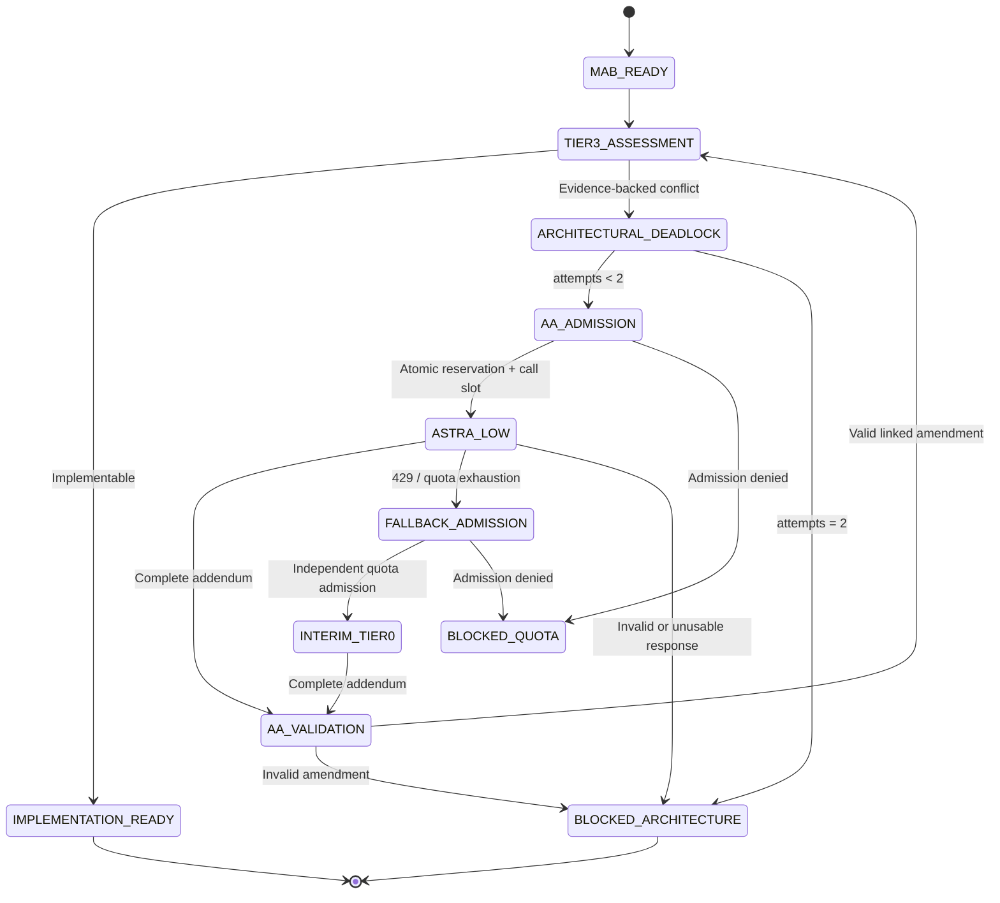

# Macro Architectural Blueprint
## AlphaBrain Context Compactor & Quota Surveillance Subsystem — ACQS

**Document:** MAB-ACQS-001 · Version 1.0  
**Authority:** Tier 0 Chief Strategic Architect  
**Disposition:** Architectural directive for Tier 3 implementation planning  
**Basis:** [ASTRA_ARCHITECTURAL_DIGEST.md](/tmp/astra_isolated/ASTRA_ARCHITECTURAL_DIGEST.md)  
**Scope:** Architecture and acceptance conditions. No implementation or deployment authorization implied.

## 1. Executive Architectural Directive & Core Invariants

ACQS SHALL make every Tier 0 invocation context-bounded, quota-admitted, isolated, and auditable.

Three components form one mandatory dispatch path:

```text
Approved task + immutable repository snapshot
                  │
                  ▼
       Context Compactor Engine
                  │ sealed context packet
                  ▼
  Quota & Telemetry Surveillance Engine
                  │ atomic reservation + admission lease
                  ▼
       Isolated Dispatch Gateway
                  │
                  ▼
          Tier 0 MAB / Addendum
                  │
                  ▼
       Tier 3 → Tier 1 → Tier 2
```

No caller may bypass QSE through direct model dispatch.

| Invariant | Binding architectural requirement |
|---|---|
| I-63: Tier separation | Astra authors architecture only. No source modifications, test execution, PR review, or bug triage. |
| Epic call bound | Maximum one initial Astra MAB invocation per epic. I-65 permits at most two additional `low` addendum invocations. |
| I-64: Quota discipline | Each dispatch reserves capacity before launch; rolling hourly consumption cannot exceed 25% of configured five-hour allowance. |
| I-65: Bounded escalation | Architectural deadlock requires evidence, advisory alternative, and persistent escalation count. |
| Context integrity | Every dispatched packet contains fewer than 2,500 tokens and binds task, repository snapshot, governance revision, and content digest. |
| Fail-closed operation | Unknown quota state, stale telemetry, invalid packet, or exhausted allowance blocks dispatch. |
| Independent verification | Fallback architecture cannot waive two-round cross-provider review or deterministic gates. |
| Immutable lineage | MABs, addenda, reservations, fallback authority, and review results remain linked through immutable audit records. |

`medium` remains initial MAB default. `low` serves bounded deadlock resolution. `high` requires recorded `--astra-high-override` authorization for digest-defined exceptional work and passes unchanged quota gates.

Digest token ranges and percentage estimates are planning hints, **not authoritative quota limits or enforceable output caps**.

---

## 2. Context Compactor Engine — CCE

### 2.1 Ownership and inputs

CCE operates outside Astra’s execution environment. It reads approved repository snapshots; Astra receives only sealed packets.

Required inputs:

- Approved task ID, epic ID, objective, scope, and acceptance criteria.
- Immutable base commit.
- Relevant `alpha_protocol` contracts.
- Authoritative invariant catalog revision.
- Target component boundaries and known environment constraints.
- For addenda: parent MAB digest and deadlock evidence.

Missing governing invariant text or unresolved contract semantics produces `CONTEXT_INCOMPLETE`; CCE SHALL NOT invent definitions.

### 2.2 Dependency graph and schema distillation

CCE SHALL build a deterministic, revision-keyed graph.

**Nodes:** modules, symbols, protocol models, fields, validators, lifecycle states, invariants, and boundary interfaces.

**Edges:** imports, references, inheritance, field types, serialization, validation, state transitions, and invariant applicability.

Algorithm:

1. **Seed selection.** Map approved task symbols and touched boundaries to graph nodes. Include I-63–I-65 and all applicable safety invariants unconditionally.
2. **Semantic closure.** Traverse required type references, inherited contract members, validators, discriminated unions, serialization aliases, and relevant lifecycle transitions.
3. **Boundary expansion.** Include direct producers and consumers when their behavior constrains compatibility. Avoid indiscriminate transitive repository expansion.
4. **Cycle normalization.** Collapse strongly connected components; emit each contract once with stable references.
5. **Protocol distillation.** Preserve:
   - Required versus optional fields, including nullable distinctions.
   - Types, defaults, enum values, bounds, and discriminators.
   - Input/output aliases, strictness, extra-field policy, and serialization effects.
   - Validator conditions and cross-field constraints.
   - Permitted transitions and error semantics.
6. **Coverage verification.** Every acceptance criterion and retained boundary must map to evidence, a preserved contract, or an explicit unresolved item.

Use Python AST analysis and revision-bound schema artifacts. Where Pydantic metadata requires execution, generate it within restricted extraction infrastructure. Never import arbitrary repository modules into privileged orchestration processes.

JSON Schema alone is insufficient when custom validators encode additional behavior. Unrepresentable semantics require a reviewed contract excerpt or blocked compaction.

### 2.3 Multi-stage AST pruning

| Stage | Transformation | Preservation requirement |
|---|---|---|
| A — Structural | Remove unrelated modules, generated files, fixtures, and implementation-only nodes. | Retain task-relevant contract closure. |
| B — Declaration | Replace function bodies with signatures and proven behavioral constraints. | Preserve validators, side effects, and failure semantics affecting boundaries. |
| C — Canonical | Deduplicate repeated types, invariants, and shared references. | Preserve identity and provenance. |
| D — Priority | Remove optional examples, historical explanations, and redundant rationale. | Never remove acceptance criteria or mandatory constraints. |
| E — Serialization | Emit compact canonical JSON; tokenize final bytes. | Validate complete packet after serialization. |

Pruning SHALL NOT truncate raw JSON or silently omit required semantics.

If mandatory content cannot fit, return `CONTEXT_OVERFLOW` with oversized sections and recommended task decomposition. Tier 3 restructures scope; Astra does not scan omitted files.

### 2.4 Token ceiling

Hard acceptance condition:

\[
T_{\text{packet}} \le 2499
\]

Planning allocations:

| Content | Target tokens |
|---|---:|
| Objective, scope, acceptance criteria | 400 |
| Governing invariants | 450 |
| Distilled schemas | 750 |
| Dependency graph and boundaries | 350 |
| Constraints, evidence, unresolved items | 300 |
| Metadata and serialization allowance | 249 |
| **Maximum** | **2,499** |

Allocations may redistribute; total ceiling remains fixed.

Use target-compatible tokenizer identified by version. Unknown tokenizer compatibility blocks dispatch unless a certified conservative upper bound remains below ceiling.

Count complete serialized packet, including metadata. Fixed gateway instructions and output-schema overhead receive separate QSE input accounting; compact packet size does not bound reasoning or output consumption.

### 2.5 Standard task context packet

Proposed `alpha_protocol` contract: `TaskContextPacketV1`, implemented with Pydantic v2, immutable fields, strict validation, and forbidden unknown fields.

| Field | Required content |
|---|---|
| `schema_version` | `"acqs.context.v1"` |
| `packet_id`, `task_id`, `epic_id` | Stable identifiers |
| `kind` | `MAB` or `AA` |
| `base_commit` | Full immutable repository revision |
| `governance_revision` | Invariant catalog digest |
| `objective` | Single bounded architectural objective |
| `scope` | Explicit inclusions and exclusions |
| `acceptance_criteria` | Stable criterion IDs and measurable outcomes |
| `invariants` | IDs, normative constraints, source references |
| `contracts` | Qualified names, fields, validation and transition semantics |
| `dependency_graph` | Retained nodes and typed edges |
| `constraints` | Environment, compatibility, security, resource restrictions |
| `evidence` | Source revision, path/symbol, content digest |
| `unresolved` | Explicit unknowns and their impact |
| `lineage` | Parent MAB/AA digest; escalation ordinal |
| `compaction` | Compiler/tokenizer versions, pruning manifest digest, token count |
| `packet_sha256` | Canonical packet digest |

Settle `token_count` before sealing. Compute SHA-256 over canonical packet with `packet_sha256` excluded; then tokenize final representation and revalidate ceiling. Gateway recomputes both before dispatch.

Source references support auditing; they do not authorize model-side retrieval.

---

## 3. Quota & Telemetry Surveillance Engine — QSE

### 3.1 Accounting model

QSE owns an append-only usage ledger and atomic reservation store, integrated with `alpha_core` orchestration.

Accounting scope SHALL match provider enforcement scope: account, organization, model pool, or equivalent quota bucket. Shared external consumption must be reconciled through authoritative telemetry; an ACQS-only ledger cannot prove account-wide compliance.

Each record includes:

```text
event_id, invocation_id, task_id, epic_id, quota_scope
provider, requested_model, reported_model_if_available, effort
provider_timestamp, received_timestamp, sequence
input_tokens, cached_input_tokens, output_tokens, reasoning_tokens
quota_units, accounting_adapter_version
measurement_kind, reservation_id, terminal_status
```

Preserve raw token categories. Do not double-count cached input or reasoning tokens when provider totals already include them.

Provider quota units and raw tokens remain separate unless a verified conversion exists. Missing conversion means quota admission is unavailable, not estimated from digest percentages.

### 3.2 Sliding five-hour tracking

For settled usage events \(q_i\) at accounting times \(t_i\):

\[
U_w(t)=\sum_{t-w<t_i\le t}q_i
\]

Maintain \(w=60\) minutes and \(w=300\) minutes. Track raw-token totals through the same windows.

Where actual consumption timestamps are unavailable, completion-time attribution is conservative for expiry. In-flight reservations remain charged until settlement.

Expose:

- Settled usage.
- Unconsumed active reservations.
- Uncertain usage holds.
- Authoritative provider utilization.
- Remaining admissible capacity.
- Telemetry age and confidence.

A sliding window has no single full reset. Report next usage expiry and earliest predicted admission time. Provider fixed-window reset, if applicable, is a separate field and an additional enforced constraint.

### 3.3 Burn velocity

For settled token usage \(N\):

\[
v_{5m}(t)=\frac{N(t)-N(t-5m)}{5}
\]

\[
v_{\text{EWMA},k}=\alpha v_k+(1-\alpha)v_{\text{EWMA},k-1}
\]

Use policy-versioned smoothing parameters. Display tokens/minute and quota-units/minute separately.

Forecast with conservative velocity:

\[
v_{\text{forecast}}=\max(v_{5m},v_{\text{EWMA}})
\]

For remaining allowance \(A\), short-horizon exhaustion estimate:

\[
ETA=A/v_{\text{forecast}}
\]

Five-hour forecasts SHALL also simulate scheduled usage expiries; weekly fixed-window forecasts need no expiry adjustment before reset. Missing observations yield `UNKNOWN`; zero observed velocity yields “no exhaustion predicted at observed rate.”

Forecasts inform scheduling. They never replace reservations.

### 3.4 Seven-day quota countdown

Weekly quota configuration requires authoritative anchor, allowance, and semantics.

For a fixed seven-day cycle:

\[
reset\_at=cycle\_start+7\text{ days}
\]

\[
countdown=\max(0,reset\_at-now)
\]

Track usage within that cycle and predict whether exhaustion precedes reset. Do not infer Monday midnight or account-creation time.

For provider rolling-seven-day limits, use a 168-hour ledger window and report next release instead of a fabricated weekly reset.

At an expected reset, stale provider telemetry does not establish replenishment. Refresh evidence before reopening admission.

### 3.5 Pre-flight Admission Gate — I-64

**Explicit design interpretation:** rolling hourly ceiling equals 25% of configured five-hour allowance \(L_5\). Tier 3 SHALL compare this interpretation against authoritative I-64 before implementation; conflicting wording triggers architectural deadlock.

Let:

- \(E_1,E_5,E_7\): conservative consumed usage, including known external usage.
- \(R\): outstanding unconsumed reservations and uncertain holds.
- \(B\): proposed invocation’s enforceable maximum quota charge.
- \(L_5,L_7\): applicable allowances.
- \(G\): bounded cancellation, reporting-delay, and accounting safety margin.

Admission requires all conditions:

\[
E_1+R+B+G\le0.25L_5
\]

\[
E_5+R+B+G<0.90L_5
\]

\[
E_7+R+B+G<0.90L_7
\]

This preserves a 10% reserve on both principal quotas while enforcing hourly guardrail independently.

Additional conditions:

- Fresh authoritative quota evidence; default maximum age 60 seconds.
- Valid packet digest and token count.
- Valid epic call count and permitted reasoning mode.
- Closed provider circuit breaker.
- Certified dispatch adapter and enforceable invocation cap.
- No conflicting active lease for identical logical invocation.

**Atomic sequence:** begin transaction → reconcile usage → evaluate gates → reserve \(B+G\) → increment applicable call slot → issue single-use lease → commit.

Lease binds packet digest, model, effort, quota scope, maximum charge, expiry, and invocation ID. Expired or reused leases cannot launch.

Empirical p95 consumption may guide scheduling but SHALL NOT serve as a hard maximum. If CLI/provider cannot enforce total charge—including hidden reasoning—and no certified bound exists, strict admission remains blocked.

### 3.6 HTTP 429 and quota exhaustion

On HTTP 429, authoritative exhaustion, or unsafe capacity uncertainty:

1. Persist failure and atomically open Astra circuit breaker.
2. Stop further Astra admissions; request cancellation of active dispatch when required.
3. Reconcile settled usage; retain uncertain reservation balance.
4. Reject incomplete output as an architectural artifact.
5. Promote Claude Opus 4.6 Thinking to **interim Tier 0** through a recorded fallback authority event.
6. Admit fallback only through its own quota checks and role restrictions.
7. If fallback cannot qualify, enter `BLOCKED_QUOTA`; preserve task for later resumption.

No immediate Astra retry loop. `Retry-After` and reset timestamps establish earliest reconsideration, not automatic permission.

Fallback lineage must appear in promotion audit metadata and eventual merge commit trailers:

```text
ACQS-Interim-Tier0: claude-opus-4-6-thinking
ACQS-Fallback-Reason: HTTP_429
ACQS-Fallback-Event: <event-id>
ACQS-Context-SHA256: <digest>
ACQS-Architecture-SHA256: <digest>
```

If normal merge strategy cannot preserve required trailers, promotion blocks pending an approved audited mechanism.

Fallback author cannot approve its own architecture-dependent review. Tier 3 must preserve independent two-round review assignment; unavailable independence blocks promotion.

---

## 4. Isolated Dispatch Gateway — IDG

### 4.1 Isolation contract

Tier 0 SHALL run in a fresh **non-Git ephemeral sandbox**. Tier 1 retains isolated Git worktrees for implementation.

Each Tier 0 sandbox contains only:

- Sealed context packet.
- Pinned response schema.
- Controlled invocation instructions.
- Minimal authenticated runtime configuration.

Repository checkout, parent workspaces, user history, inherited skills, MCP integrations, hooks, and arbitrary tools must remain unavailable.

Locally inspected CLI supports this invocation shape:

```sh
# Invoke Tier 0 with sealed context inside an already-provisioned isolated sandbox.
codex exec \
  --ignore-user-config \
  --ephemeral \
  --skip-git-repo-check \
  --sandbox read-only \
  --json \
  --color never \
  --model gpt-6-astra \
  --config 'model_reasoning_effort="medium"' \
  --cd "$ACQS_SANDBOX_DIR" \
  --output-schema "$ACQS_RESPONSE_SCHEMA" \
  - < "$ACQS_PACKET_PATH"
```

`--json` emits JSONL events; non-interactive execution and structured output are documented by [OpenAI](https://learn.chatgpt.com/docs/non-interactive-mode).

**Flags alone do not establish complete isolation.**

- `--skip-git-repo-check` permits execution outside Git; it does not prohibit scanning.
- `--ephemeral` controls session persistence; it does not disable all inherited configuration.
- Read-only mode restricts writes; it does not prohibit repository reads.
- `--worktree` is deliberately absent for Tier 0.

Supervisor SHALL enforce filesystem visibility, disable tools/hooks through a certified runtime profile, restrict network access to necessary provider endpoints, and reject uncontrolled instruction injection. Do not use approval or hook-trust bypass flags.

Absence of Git metadata and Git operations removes Tier 0 Git-hook overhead. CLI startup hooks require separate disablement.

### 4.2 Streaming telemetry parser

IDG SHALL parse stdout incrementally as bounded UTF-8 JSONL; stderr remains a separate diagnostic channel.

Parser requirements:

1. Buffer partial lines and split across arbitrary transport chunk boundaries.
2. Enforce line-size limits and versioned event validation.
3. Normalize lifecycle, usage, terminal failure, and quota events.
4. Deduplicate stable provider event IDs; otherwise use adapter-defined sequence identities.
5. Distinguish cumulative usage snapshots from incremental deltas.
6. Atomically replace consumed reservation portions with settled usage.
7. Persist events before acknowledging terminal completion.
8. Treat missing terminal usage as `USAGE_UNCERTAIN`, retaining conservative holds.

Process exit code alone does not establish successful completion. Require terminal success, schema-valid output, durable lineage, and accounting reconciliation.

**Real-time boundary:** JSON streaming does not guarantee per-token accounting. When installed adapter exposes usage only at turn completion, report:

```text
usage_status = RESERVED_IN_FLIGHT
measured_usage = last_authoritative_measurement
estimated_usage = separately_labeled_estimate
```

Never label character-count estimates or elapsed-time projections as measured tokens. Strict enforcement relies on reserved, enforceable maximum charge—not monitoring latency.

---

## 5. I-65 ARCHITECTURAL_DEADLOCK Handover Protocol

### 5.1 Deadlock evidence contract

Tier 3 raises `ArchitecturalDeadlockV1` only when implementation conflicts with architecture or unavoidable environment constraints.

Required fields:

```text
deadlock_id, epic_id, task_id
mab_sha256, latest_addendum_sha256
base_commit, governance_revision
blocking_clause, constraint_evidence
failure_trace_digest, minimal_reproduction_summary
advisory_alternative, alternative_risks
requested_architectural_decision
tier3_attestations, escalation_ordinal
```

Failure trace remains evidence for architectural correction; it does not authorize Tier 0 bug triage or repository investigation.

### 5.2 State transition diagram



### 5.3 Bounded resolution loop

- Maximum **two Astra `low` addendum invocations per epic**, shared across descendants and task retries.
- Count increments atomically before launch. Crash or uncertain dispatch consumes its allocated attempt unless non-launch is proven.
- Initial MAB call remains separate; no second `medium` MAB call disguises an escalation.
- Each addendum packet stays below 2,500 tokens and passes unchanged QSE admission.
- Fallback substitution does not reset or expand deadlock count.
- Permit at most one fallback dispatch per failed logical invocation; further fallback failure blocks.
- Unresolved conflict after second addendum enters `BLOCKED_ARCHITECTURE`; no automatic third loop.

Architectural Addendum must contain:

```text
aa_id, parent_mab_sha256, prior_aa_sha256
deadlock_id, escalation_ordinal
disposition: AMEND | REJECT_ALTERNATIVE | UNRESOLVABLE
superseded_clause_ids, replacement_clauses
invariant_impact, rationale, acceptance_deltas
author_role, model, effort, authority_event_id
```

Original MAB remains immutable. Effective architecture equals original MAB plus ordered, validated addenda. Addenda cannot relax governing invariants without separate governance authorization.

---

## 6. Tier 3 Delivery and Acceptance Mandate

Tier 3 SHALL translate this MAB into implementation blueprints and worker dispatch packets. Proposed ownership:

| Layer | Responsibility |
|---|---|
| `alpha_protocol` | Context packets, telemetry records, admission leases, deadlocks, addenda |
| `alpha_core` | CCE, quota ledger, atomic admission, fallback authority, escalation state |
| Dispatch runtime | Isolation enforcement, CLI adapter, JSONL parser, cancellation |
| Tier 2 | Deterministic architecture-compliance gates |

Required acceptance evidence:

- Identical snapshot and inputs produce identical sealed packet.
- Packets containing 2,500 tokens fail admission.
- Pruning preserves defaults, aliases, validators, unions, and lifecycle constraints.
- Concurrent admissions cannot overbook hourly, five-hour, or weekly allowances.
- Reset boundaries, expiry timing, external usage, and stale telemetry behave conservatively.
- Duplicate/cumulative events cannot double-count; interrupted streams cannot refund unknown usage.
- HTTP 429 closes Astra dispatch and preserves auditable fallback lineage.
- Tier 0 cannot access repository content or execute inherited hooks.
- Restarts cannot reset epic MAB count or two-attempt deadlock bound.
- No architecture output reaches implementation before schema, authority, and lineage validation.

Tier 2 requires zero test failures, zero lint errors, and deterministic SafetyGate compliance. Reusable test scripts belong under `testscript/`.

**Release gate:** unresolved quota semantics, unenforceable consumption bounds, incomplete isolation, or broken audit lineage keep ACQS dispatch disabled.

Prior AlphaBrain memory informed immutable-packet and independent-evidence requirements only; current runtime readiness was not inferred from those older notes.

