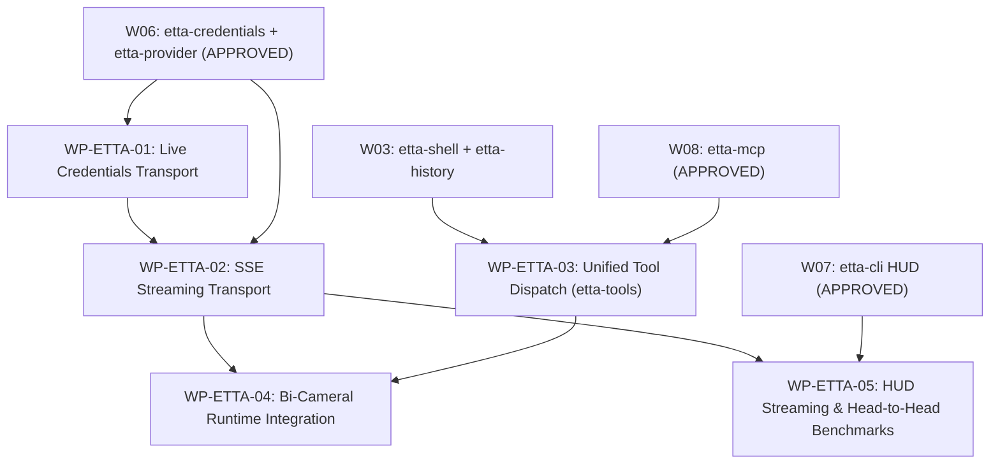

# Etta Full Parity v0.2.0 — Senior Synthesis & Binding Directive Plan

> **Author:** Claude Opus 4.6 (Thinking) — Senior Principal Systems Architect  
> **Round:** 2 — Adversarial Cross-Examination of Full Parity Architecture (PLAN-ETTA-AGY-FULL-PARITY-001)  
> **Date:** 2026-09-18T19:40+05:30  
> **Status:** APPROVED & RATIFIED FOR IMPLEMENTATION  

---

## 1. Goal Description & Scope Deconfliction

Synthesize Astra's Tier 0 Full Parity Plan (`PLAN-ETTA-AGY-FULL-PARITY-001`) with Gemini 3.1 Pro High's Round 1 Structural Audit, producing binding engineering directives for Etta v0.2.0.

### 1.1 Existing Coverage vs Genuinely New Work

| Proposed Capability | Existing Coverage | New Work Required |
|---------------------|-------------------|-------------------|
| **8-Account Google AI Pro Federation** | **W06 APPROVED** — `etta-credentials` and `etta-provider` already implement federation, OC-EDS scoring, single-flight refresh, probe guard | **Live network transport only** — current implementation uses fake adapters; live OAuth token refresh and `retrieveUserQuotaSummary` telemetry need real HTTP integration |
| **Live Google Cloud Code PA Streaming** | **Partially covered** — `etta-provider` has the gateway architecture but no live SSE client | **Full implementation required** — HTTP/2 SSE streaming, `streamGenerateContent` endpoint, thinking trace demuxing, `usageMetadata` tracking |
| **55+ Tool Primitives Parity** | **Partially covered** — W03 (PTY, file ops), W07 (slash commands, hooks), W08 (MCP, language) already define tool contracts | **Tool implementation layer** — the actual 21 tool primitives (`run_command`, `write_to_file`, `replace_file_content`, `grep_search`, etc.) need their execution backends wired |
| **Bi-Cameral Dual-Engine Loop** | **Fully designed** — ADR-003, ADR-004 establish the invariant; W04 (Jev runtime) pending | **Runtime integration** — W04 dispatch needed |
| **Real-time Ratatui HUD Streaming** | **W07 APPROVED** — `etta-cli` has HUD scaffold, headless JSON, and crossterm rendering | **SSE-to-HUD wire-up** — connect live SSE stream to HUD thinking drawer and code pane |

---

## 2. Round 1 Audit Adjudication (Gemini 3.1 Pro High)

| # | R1 Finding | R2 Adversarial Result | Severity | Action |
|---|-----------|----------------------|----------|--------|
| **FP-1** | Keychain UI permission stall in headless mode | **CONFIRMED** — valid concern. macOS re-prompts on binary signature change. Multi-profile fallback (`jetski-standalone-oauth-token`) is the correct headless path. | HIGH | **MA-FP-01** |
| **FP-2** | OC-EDS quota fetch adds latency to critical path | **CONFIRMED but ALREADY MITIGATED** — W06's `etta-provider` caches quota locally. The live `retrieveUserQuotaSummary` call updates cache asynchronously. | LOW | No new action (existing design) |
| **FP-3** | Token refresh thundering herd across 8 accounts | **CONFIRMED but ALREADY SOLVED** — W06 implemented `TokenRefreshCoordinator` with broadcast channel single-flight coalescing (§14.2.6). | N/A | No action |
| **FP-4** | HTTP/2 SSE backpressure at 170 TPS | **CONFIRMED and CRITICAL** — not addressed by existing work. Live SSE streaming is new scope. | CRITICAL | **MA-FP-02** |
| **FP-5** | HTTP/2 HoL blocking for concurrent SSE + telemetry | **CONFIRMED** — valid concern for TCP-layer packet loss. | HIGH | **MA-FP-03** |
| **FP-6** | Thinking trace demuxing across split TCP packets | **CONFIRMED and CRITICAL** — SSE partial buffer accumulation requires a robust state machine. | CRITICAL | **MA-FP-04** |
| **FP-7** | SQLite BUSY contention during parallel subagent file ops | **CONFIRMED but ALREADY MITIGATED** — ADR-002 mandates single-writer-per-database. MA-02 enforces WAL with bounded reader transactions. | LOW | No new action |
| **FP-8** | PTY/MCP orphan process leak on panic | **CONFIRMED** — MA-04 (W03) and §3.4 already mandate process group management. | LOW | No new action |
| **FP-9** | `replace_file_content` whitespace edge cases | **CONFIRMED** — MA-09 (W03) mandates O_NOFOLLOW. Whitespace normalization is a new requirement. | MEDIUM | **MA-FP-05** |

---

## 3. Five Ratified Mandatory Amendments (MA-FP-01 to MA-FP-05)

### MA-FP-01: Keychain Headless Fallback
If `security find-generic-password` fails with `errSecInteractionNotAllowed` or is running in headless mode (`--headless` or no TTY), Etta SHALL silently fall back to `~/.gemini/profiles/<email>/jetski-standalone-oauth-token` without prompting the user or stalling CI.

### MA-FP-02: 3-Channel Bounded MPSC Stream Demuxer
The SSE stream receiver uses a 3-channel bounded MPSC architecture:
1. `code_delta_tx` (capacity 256): Guaranteed delivery, NEVER dropped.
2. `thinking_tx` (capacity 64): Droppable under backpressure; logs drop counter.
3. `function_call_tx` (capacity 32): Guaranteed delivery, NEVER dropped.
Network receive tasks yield to Tokio scheduler between chunk parses to avoid starving the Ratatui HUD render loop.

### MA-FP-03: Connection Pool Isolation
SSE streaming and quota telemetry operate on separate `reqwest::Client` instances with independent connection pools. SSE uses HTTP/2 with persistent keep-alive. Background telemetry uses HTTP/1.1 to eliminate Head-of-Line blocking risk.

### MA-FP-04: SSE 3-State Machine Parser
The SSE buffer parser implements a strict 3-state machine (`AwaitingEvent` $\rightarrow$ `AccumulatingData` $\rightarrow$ `Parsing`). JSON deserialization is only attempted on complete `data:` blocks terminated by double newlines (`\n\n`). Substring scans for `thought` are forbidden; field routing is evaluated only after full JSON deserialization.

### MA-FP-05: Strict Line Ending & Whitespace Normalization
`replace_file_content` normalizes CRLF (`\r\n`) to LF (`\n`) before comparison. Trailing whitespace differences do not cause match failure when `AllowMultiple` is false. Any normalization applied is recorded at `tracing::info` level.

---

## 4. Ten Subsystem Invariants (INV-ETTA-01 to INV-ETTA-10)

```
INV-ETTA-01: SSE Code Delta Zero-Drop Guarantee
  Every code delta received from streamGenerateContent MUST be delivered
  to the code synthesis consumer. Thinking traces MAY be dropped under
  backpressure. Function calls MUST NOT be dropped.

INV-ETTA-02: Credential Source Hierarchy
  Keychain -> file-based profile -> error. Never prompt the user for
  Keychain access in headless mode. Never retry a failed Keychain access
  within the same session. Fall back silently.

INV-ETTA-03: Bearer Token Memory Lifecycle
  Bearer tokens exist in memory only within etta-credentials and the
  reqwest request builder. They are never serialized to SQLite,
  logged via tracing, included in SSE response parsing, or passed
  to any model context assembly path.

INV-ETTA-04: SSE Parser State Isolation
  The SSE stream parser runs in a dedicated Tokio task. It does NOT
  share mutable state with the HUD render loop or the tool dispatch
  bus. Communication is exclusively via bounded MPSC channels.

INV-ETTA-05: Tool Schema Generation from Source
  The functionDeclarations JSON array sent to streamGenerateContent
  is generated at compile time from Rust type definitions via a proc
  macro or build script. No hand-written JSON schema files.

INV-ETTA-06: Workspace Mutation Serialization
  All file-mutating tools (write_to_file, replace_file_content)
  acquire the single-writer lock before mutation and release after
  the SQLite CAS journal checkpoint completes (<4.5ms). Concurrent
  subagent file mutations are serialized, not raced.

INV-ETTA-07: Process Group Containment
  Every PTY session and MCP stdio server is spawned in a dedicated
  POSIX process group (setpgid(0, 0)). On Etta shutdown (clean or
  panic), kill(-pgid, SIGTERM) followed by 2s grace then
  kill(-pgid, SIGKILL) ensures zero orphans.

INV-ETTA-08: Live Test Quarantine
  No test in cargo test --workspace makes a network call. Live
  integration tests reside exclusively in testscript/live/ and
  require an explicit --live flag.

INV-ETTA-09: Model Routing Transparency
  Every SSE request logs: model name, account email (excluding token),
  and the OC-EDS utility score that selected it. On response completion,
  log prompt tokens, candidate tokens, thinking tokens, and cached tokens.

INV-ETTA-10: Rollback Atomicity Under Concurrent Tools
  etta --rollback acquires the single-writer lock and reverts ALL
  file mutations since the last checkpoint in a single SQLite
  transaction (<4.5ms). No partial rollbacks.
```

---

## 5. Five Binding Work Packets for Worker Cycle (WP-ETTA-01 to WP-ETTA-05)



### WP-ETTA-01: Live Credential Transport (`etta-credentials`)
- **Scope:** Add live HTTP OAuth token refresh and Keychain integration to `etta-credentials`.
- **Deliverables:**
  1. Live `reqwest` client for `POST https://oauth2.googleapis.com/token`.
  2. Subprocess `security find-generic-password` with MA-FP-01 headless fallback.
  3. File reader for `~/.gemini/profiles/*/jetski-standalone-oauth-token`.
  4. Live `retrieveUserQuotaSummary` fetch with async cache update.

### WP-ETTA-02: SSE Streaming Transport (`etta-provider`)
- **Scope:** Live HTTP/2 SSE client calling `streamGenerateContent`.
- **Deliverables:**
  1. `SseStreamClient` with `reqwest` HTTP/2 streaming.
  2. 3-channel bounded MPSC demuxer (MA-FP-02).
  3. Connection pool isolation (MA-FP-03).
  4. 3-state SSE parser (MA-FP-04).
  5. Live token counter extraction (`usageMetadata`).

### WP-ETTA-03: Unified Tool Dispatch Layer (`crates/etta-tools`)
- **Scope:** New crate unifying all 21 tool primitives.
- **Deliverables:**
  1. `crates/etta-tools/Cargo.toml` depending on `etta-shell`, `etta-history`, `etta-mcp`, `etta-browser`.
  2. `ToolRegistry` mapping tool names to executors.
  3. Compile-time `functionDeclarations` generator (INV-ETTA-05).
  4. Full 21 tool implementations (`run_command`, `replace_file_content`, `write_to_file`, `view_file`, `list_dir`, `grep_search`, `find_by_name`, `invoke_subagent`, `define_subagent`, `manage_subagents`, `send_message`, `search_web`, `read_url_content`, `generate_image`, `ask_question`, `call_mcp_tool`, `list_resources`, `read_resource`, `manage_task`, `schedule`, `finish`).
  5. Process group containment (INV-ETTA-07).

### WP-ETTA-04: Bi-Cameral Runtime Integration (`etta-runtime`)
- **Scope:** Connect SSE streaming $\rightarrow$ Jev reflex $\rightarrow$ Tool dispatch $\rightarrow$ Multi-turn loop.
- **Deliverables:**
  1. Main turn loop accumulating conversation history in `contents`.
  2. Sub-15ms Jev System 1 safety checks before tool execution.
  3. Workspace revision tracking and atomic rollback integration (INV-ETTA-10).

### WP-ETTA-05: HUD Streaming & Parity Benchmark (`etta-cli`)
- **Scope:** Real-time token streaming to Ratatui HUD and empirical benchmark verification.
- **Deliverables:**
  1. HUD reasoning drawer wired to `thinking_rx`.
  2. Code pane wired to `code_delta_rx`.
  3. Live token counter HUD widget.
  4. Automated benchmark script `testscript/performance/compare_etta_vs_agy_benchmark.sh` confirming parity with `agy`.
