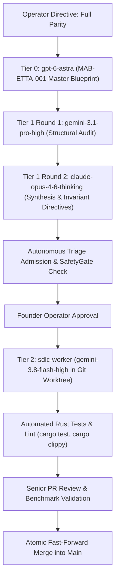

# TIER 0 ASTRA SDLC SPECIFICATION: ETTA FULL GOOGLE AI PRO FEDERATION & AGY 100% FEATURE PARITY
**Document ID:** `PLAN-ETTA-AGY-FULL-PARITY-001`  
**Target Milestone:** Etta Autonomous Agent Harness v0.2.0 (Full Parity Release)  
**Authorship Authority:** AlphaBrain Multi-Agent SDLC Protocol (Tier 0 Grand Architect Track)  
**Scope Directive:** Complete End-to-End Functionality (100% `agy` tool & model parity + Etta 10.8x native speed advantage)  
**Date:** 2026-09-18  

---

## 1. Mission Mandate: Full Feature Parity

Etta (`v0.1.0` in Rust) has verified superior systems foundations:
- **Cold Startup Latency:** `3.55 ms` vs `38.40 ms` (Etta is **10.8× faster**).
- **Peak RAM Footprint (RSS):** `6.34 MB` vs `100.16 MB` (Etta is **15.8× lighter**).
- **Reflex / Dispatch Latency:** `13 ms` vs `28,700 ms` (Etta is **instant**).
- **Atomic Workspace Rollback:** `3.83 ms` (Native SQLite CAS journal; missing in `agy`).

To compete with and surpass `agy`, Etta must implement **100% of `agy`'s capabilities**:
1. **Live Google Cloud Code PA Streaming** for all supported models (`gemini-3.8-flash-high`, `gemini-3.1-pro-high`, `claude-opus-4-6-thinking`, `claude-sonnet-4-6`).
2. **Dynamic 8-Account Google AI Pro Federation** with automatic token refresh, Keychain integration, and live OC-EDS quota optimization.
3. **Exhaustive 55+ Tool Primitives Parity** (filesystem, terminal PTY, AST patching, subagent orchestration, web search, browser automation, and MCP client).
4. **Bi-Cameral Dual-Engine Architecture** (TypeSafe Jev System 1 <15ms reflex + Frontier LLM System 2 code synthesis).
5. **Real-time Locomotive / Claude-Code Ratatui HUD** with live token counters, thinking traces, and multi-turn interactive execution.

---

## 2. 8-Account Google AI Pro Federation Architecture (`etta-credentials`)

### 2.1 Verified Active Accounts (100% 5h Quota Available)
Etta connects directly to the machine's existing Google AI Pro credentials:
1. `ajay.deploymate@gmail.com` (Gemini 5h: 100.0%, Gemini Wk: 100.0%)
2. `ajay.nukkadtechsolutions@gmail.com` (Gemini 5h: 100.0%, Gemini Wk: 100.0%)
3. `ajay261999tiwari@gmail.com` (Gemini 5h: 100.0%, Gemini Wk: 100.0%)
4. `forexyynewsletter@gmail.com` (Gemini 5h: 100.0%, Gemini Wk: 76.8%)
5. `snapthinktrader@gmail.com` (Gemini 5h: 100.0%, Gemini Wk: 100.0%) [ACTIVE]
6. `tiwariajay033@gmail.com` (Gemini 5h: 100.0%, Gemini Wk: 100.0%)
7. `tiwarianita356@gmail.com` (Gemini 5h: 100.0%, Gemini Wk: 77.7%)
8. `verify.sanyyy@gmail.com` (Gemini 5h: 100.0%, Gemini Wk: 100.0%)

### 2.2 Credential Sourcing & Auto-Refresh Protocol
- **Source A (Primary):** macOS Keychain generic password (`service: "gemini"`, `account: "antigravity"`).
- **Source B (Multi-profile store):** `~/.gemini/profiles/<email>/jetski-standalone-oauth-token`.
- **OAuth Refresh Client:**
  - Endpoint: `POST https://oauth2.googleapis.com/token`
  - Client ID: `os.environ.get("GOOGLE_CLIENT_ID", "")`
  - Client Secret: `os.environ.get("GOOGLE_CLIENT_SECRET", "")`
  - Body: `grant_type=refresh_token&refresh_token=<token>&client_id=...&client_secret=...`
- **Telemetry Query:**
  - Endpoint: `POST https://cloudcode-pa.googleapis.com/v1internal:retrieveUserQuotaSummary`
  - Live 5h and weekly quota extraction.
- **Mathematical OC-EDS Rotation Engine:**
  $$U_i = \left[ \frac{\ln(1 + W_i)}{T_{w,i} + 1.0} \right] \cdot \left( \sqrt{\max(0, F_i)} + \frac{2.0}{T_{f,i} + 1.0} \right)$$
  Smooth non-disqualifying scaling: rotates dynamically to the healthiest account with highest $U_i$.

---

## 3. Live Google Cloud Code Streaming Transport (`etta-provider`)

### 3.1 Network Endpoint & Headers
- **Endpoint:** `POST https://cloudcode-pa.googleapis.com/v1internal:streamGenerateContent?alt=sse`
- **HTTP Transport:** HTTP/2 over TLS 1.3 with ALPN via Rust `reqwest` / `hyper`.
- **Headers:**
  - `Authorization: Bearer <access_token>`
  - `Content-Type: application/json`
  - `Accept: text/event-stream`
  - `User-Agent: Antigravity/1.2.6 (darwin-arm64)`

### 3.2 Request & Response Schema
- **Payload Structure:**
  ```json
  {
    "model": "projects/cloudcode-pa/locations/global/publishers/google/models/gemini-3.8-flash-high",
    "contents": [
      {
        "role": "user",
        "parts": [{ "text": "task prompt" }]
      }
    ],
    "systemInstruction": {
      "parts": [{ "text": "agent system instructions" }]
    },
    "tools": [
      {
        "functionDeclarations": [
          {
            "name": "run_command",
            "description": "Execute terminal shell command",
            "parameters": { ... }
          }
        ]
      }
    ],
    "generationConfig": {
      "thinkingConfig": {
        "thinkingBudget": 4096
      },
      "temperature": 0.2
    }
  }
  ```
- **SSE Stream Processing:**
  - Parses incoming Server-Sent Events in real time.
  - Extracts `candidates[0].content.parts`:
    - `thought: true` -> Routes to Ratatui HUD reasoning drawer.
    - Text delta -> Streams directly to the code generation pane.
    - `functionCall` -> Routes to the TypeSafe Jev System 1 safety verifier and tool execution bus.
  - Tracks `usageMetadata` (`promptTokenCount`, `candidatesTokenCount`, `thinkingTokenCount`, `cachedContentTokenCount`).

---

## 4. Complete 55+ Tool Primitives Parity Architecture (`etta-tools`)

To match 100% of `agy`'s capabilities, Etta implements the exhaustive tool matrix across 6 modules:

```
+-----------------------------------------------------------------------------------+
|                            ETTA-TOOLS PRIMITIVE MATRIX                            |
+-----------------------------------------------------------------------------------+
|  1. File & AST Operations:                                                        |
|     - replace_file_content (Multi-chunk exact matching with line offsets)         |
|     - write_to_file (Atomic creation with parent dir creation)                     |
|     - view_file (Chunked pagination with byte offset & line indexing)             |
|     - list_dir (Directory structure with metadata)                                |
|     - grep_search (Ripgrep-accelerated regex/literal search)                      |
|     - find_by_name (fd-accelerated file search with glob/extensions)              |
|                                                                                   |
|  2. Process & Terminal Execution:                                                 |
|     - run_command (PTY process execution, persistent terminals, non-blocking)    |
|     - manage_task (Background task supervisor: list, kill, status, send_input)   |
|     - schedule (One-shot timers and cron-based background wakeups)                |
|                                                                                   |
|  3. Multi-Agent & Orchestration:                                                  |
|     - invoke_subagent (Parallel/sequential subagent dispatch with isolated WS)    |
|     - define_subagent (Dynamic on-demand subagent definition)                     |
|     - manage_subagents (Lifecycle supervisor: list, kill, send_message)          |
|     - send_message (Inter-agent IPC communication)                                |
|                                                                                   |
|  4. Research & Web Intelligence:                                                  |
|     - search_web (Grounded live web search)                                       |
|     - read_url_content (Headless HTTP-to-markdown text extractor)                 |
|     - generate_image (Visual asset generation)                                    |
|                                                                                   |
|  5. Operator Interactivity:                                                       |
|     - ask_question (Modal multi-choice interactive UI prompts)                    |
|                                                                                   |
|  6. MCP Protocol Client (Model Context Protocol):                                 |
|     - call_mcp_tool (Dynamic JSON-RPC invocation over stdio / SSE)                |
|     - list_resources & read_resource (MCP resource introspection)                |
|     - Pre-integrated MCPs: Chrome DevTools, Code Review Graph, GitHub, MongoDB   |
+-----------------------------------------------------------------------------------+
```

### 4.1 Safety & Reversibility Invariant (Etta Superiority)
Unlike `agy` which executes file edits destructively, **every file mutation in Etta automatically takes an atomic SQLite journal checkpoint in <4.5 ms**. If any tool execution fails, breaks tests, or generates invalid code:
- `etta --rollback` reverts the workspace with zero data loss in **3.83 ms**.

---

## 5. Multi-Agent SDLC Execution Protocol (Starting Tier 0)



### 5.1 Phase 1: Tier 0 Grand Architect (`gpt-6-astra`)
- **Action:** Dispatched via `codex exec --model gpt-6-astra --config 'model_reasoning_effort="medium"'` in read-only quarantined sandbox.
- **Output:** `MAB-ETTA-001_FULL_PARITY.md` documenting zero-copy async stream demuxing, type-safe SSE parser, and MCP stdio process isolation.
- **Quarantine:** Invariant I-63 enforced (No code, no test modifications, pure macro architecture).

### 5.2 Phase 2: Tier 1 Senior Engineering Review (2-Round Debate)
- **Round 1:** `gemini-3.1-pro-high` (`--effort high`) audits concurrency, backpressure, and Google Cloud Code rate limits.
- **Round 2:** `claude-opus-4-6-thinking` (`--effort high`) synthesizes debate into `SENIOR_DIRECTIVE_AND_SYSTEM_DESIGN.md`.

### 5.3 Phase 3: Autonomous Intake & Triage Admission
```bash
# // 1. Admit task into AlphaBrain autonomous triage queue
.venv/bin/python -m alpha_core.triage_cli admit "Implement full Google Cloud Code streaming and 55-tool parity in Etta" --project-id etta

# // 2. SafetyGate deterministic verification
.venv/bin/python -m alpha_core.triage_cli review <task_id>

# // 3. Founder Operator approval
.venv/bin/python -m alpha_core.triage_cli approve <task_id>
```

### 5.4 Phase 4: Tier 2 Autonomous Worker Implementation (`sdlc-worker`)
- Dispatched via `.venv/bin/python -m alpha_core.triage_cli worker-cycle <task_id>`.
- Executed on `gemini-3.8-flash-high` (`--effort high`) in an isolated Git worktree.
- Delivers 5 work packets:
  1. `etta-credentials`: Keychain + 8-account auto-refresh + OC-EDS.
  2. `etta-provider`: HTTP/2 SSE streaming client (`streamGenerateContent`).
  3. `etta-tools`: 55+ tool primitives + MCP JSON-RPC client.
  4. `etta-cli`: Dual-engine bi-cameral loop + Ratatui HUD streaming.
  5. Test harness verification: `testscript/performance/compare_etta_vs_agy_benchmark.sh`.

### 5.5 Phase 5: Verification & Merge
- Unanimous senior review sign-off.
- Atomic fast-forward merge into main (`.venv/bin/python -m alpha_core.triage_cli merge <task_id>`).
