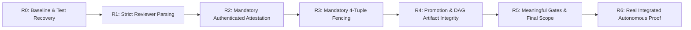

# Astra Consultant Architecture Review & Remediation Blueprint

**Date:** 2026-09-06  
**Baseline Evaluated:** Commit `388b77aa2cf2959710fa5d94488f6d13f3c12e13`  
**Status:** Review Rejected — Meaningful structural repairs landed, but "T2–T6 100% complete" was premature and architecturally unverified.

---

## 1. Executive Summary & Verification Matrix

Independent audit of `388b77a` revealed:

| Metric / Check | Audit Finding | Root Cause & Severity |
|---|---|---|
| **Full Pytest Suite** | **180 failed, 490 passed, 13 errors, 11 skipped** | Legacy test fixtures omit newly required 40-char `base_commit` or canonical 64-char `content_hash`. |
| **T6 Tests Alone** | 6 passed (0.91s) | Tests pass, but harness relied on `DummyBridge`, `echo passed`, and direct SQLite state mutation. |
| **Ruff / Mypy** | Passed | Clean type checks on trust-boundary files. |
| **Formatting** | **20 files fail** | Formatting debt across core modules. |

---

## 2. Seven Confirmed Critical Trust & Autonomy Gaps

1. **Unsigned Promotion Accepted (`alpha_core/triage_cli.py:655`)**:
   - Attestation verification is guarded by `if attestation_dict:`. If omitted, merge proceeds directly to `git merge --ff-only <result_sha>`. Complete inversion of fail-closed security.
2. **Wrong-Task Review Accepted (`alpha_core/triage_cli.py:670`)**:
   - Attestation signature is verified mathematically, but `att.task_id == task["id"]` and `att.evidence_digest == compute_digest(task["result"]["evidence"])` are never validated. Attestation replay and cross-task substitution attacks are trivially possible.
3. **Predictable Signing Fallback & Evidence Key Drift (`alpha_worker/senior_review_engine.py:68, 295`)**:
   - Falls back to static string `"alphabrain_senior_review_key"` if `ALPHA_SIGNING_SECRET` is unset.
   - Reviewer hashes `task["result"]["gate_result"]`, while dispatcher records `task["result"]["evidence"]`.
4. **Fencing Optional Internally (`alpha_core/queue/triage_queue.py:723` & `alpha_worker/triage_dispatcher.py:546`)**:
   - Queue only appends fencing SQL conditions if all 4 tokens are passed. Dispatcher calls `complete_task` and `fail_task` without them, bypassing concurrency fencing completely.
5. **Permissive Parser Accepts Trailing Rejection (`alpha_worker/senior_review_engine.py:204`)**:
   - `parse_verdict_line` reverses lines and skips non-JSON text. Quoted or earlier `APPROVE` followed by `Final decision: REJECT` returns `APPROVE`.
6. **DAG Uses Approval Boolean Rather than Promoted Artifact (`alpha_core/queue/triage_queue.py:528`)**:
   - Child tasks unblock when `senior_review.approved == 1`, even before the parent commit has been merged/promoted to the destination repo.
7. **T6 Uses Mocked Autonomy Instead of Real Autonomous Proof (`testscript/test_astra_t6_integrated.py:100`)**:
   - Relies on `DummyBridge`, `echo passed`, and direct SQLite record updates rather than authentic AGY worker execution and genuine Senior Review Engine invocation.

---

## 3. Four New Architectural & Operational Deficiencies

In addition to the 7 trust gaps, Astra's systemic inspection uncovered:

1. **Reviewer Independence Inversion (`alpha_worker/senior_review_engine.py:263`)**:
   - Review is hardcoded Gemini Pro $\rightarrow$ Claude Opus. Opus receives Pro's opinion first and is explicitly forbidden from reading files on disk. Reviewers must be capable of independent verification.
2. **Unbounded Infinite Repair Loop (`alpha_core/queue/triage_queue.py:796`)**:
   - `queue_task_for_senior_repair` appends instructions and sets status directly to `APPROVED` without checking `cumulative_retries` or requiring fresh operator authorization for modified scopes.
3. **Mocked SDLC Runner Auto-Approvals (`alpha_core/workflow/sdlc_workflow.py:53`)**:
   - Auto-approves specifications and previews (`self.spec_approved = True`, `self.preview_accepted = True`), then marks tasks as `DEPLOYED` without real infrastructure deployment.
4. **Eva Extractor Directory Hardcoding (`alpha_core/eva/task_proposer.py:24, 33`)**:
   - Defaults to `default_repo = "."`, `base_commit = "HEAD"`, and unscoped `pytest -q`. Real project planning requires repository-aware context and technology research.

---

## 4. Multi-Tier Team Responsibility Model

Models alone cannot establish authority or independence. Roles must have clear separation of duties:

| Role | Responsibility | Required Concrete Output |
|---|---|---|
| **Senior Architect** | Requirements trade-offs, security, system architecture, disputed findings adjudication. | Approved design, risk assessment, formal acceptance criteria. |
| **Mid-Level Planner / Implementer** | Decompose architecture into bounded packets, define contracts and dependencies, implement complex logic. | Bounded task envelopes, typed acceptance plans, integration scaffolding. |
| **Junior Executor** | Small, scoped implementation units, mechanical edits, test execution. | Exact diff, reproducible test evidence. |
| **Independent Reviewer** | Inspect result commit, challenge test coverage and assumptions without seeing prior verdicts. | Cryptographic attestation bound to exact commit & evidence digest. |
| **AlphaBrain Controller** | Enforce permissions, state transitions, retry budgets, concurrency fencing, and promotion locks. | Durable, immutable, auditable database records. |

---

## 5. Seven Architectural Design Requirements

1. **One Authoritative Lifecycle**: Consolidate original `TaskEngine` and newer `TaskTriageQueue` behind shared typed contracts. Eliminate competing state semantics.
2. **Research & Design Before Decomposition**: Require source-backed alternatives, build-vs-buy analysis, architecture records, threat models, and requirement-to-test matrices.
3. **Independent Review Before Debate**: Reviewer must inspect the exact result commit and execute checks without prior model bias. Senior architect adjudicates disagreements afterward.
4. **Structured Bounded Repair Loop**: Findings require IDs, severity, reproduction steps, affected requirement, and regression tests. Repairs consume lifetime cumulative budgets; scope changes require new founder review.
5. **Risk-Based Model Routing**: Fast models for mechanical edits, strong coding models for implementation, senior models for architecture, security, and dispute resolution.
6. **Measure Accepted Outcomes**: Track cost per accepted task, first-pass acceptance rate, escaped defects, repair rounds, and elapsed delivery time against a fixed benchmark.
7. **Durable Orchestration**: Persist waits, retry budgets, review requests, and promotion outcomes idempotently (e.g. Temporal-ready lifecycle).

---

## 6. The R0–R6 Remediation Sequence

### Packet Specifications:
- **Packet R0 — Reproducible Baseline & Test Recovery**:
  - Baseline capture, classify 180 failures (fixtures vs regressions).
  - Backfill fixtures with valid 40-char `base_commit` and canonical 64-char `content_hash` without relaxing schemas.
  - Fix formatting on 20 files. Ensure full suite is green.
- **Packet R1 — Strict Reviewer Parsing (T1)**:
  - Last-line JSON parsing; reject trailing text, ambiguous verdicts, fenced outputs, and duplicate keys.
  - Validate independent per-stage verdicts.
- **Packet R2 — Mandatory Authenticated Attestation (T3)**:
  - Fail-closed promotion: missing attestation strictly rejects.
  - Require `ALPHA_SIGNING_SECRET` (no fallback).
  - Bind `task_id`, `evidence_digest`, `base_commit`, `result_sha`.
- **Packet R3 — Mandatory Fencing on Every Mutation (T2)**:
  - Enforce `worker_id`, `lease_id`, `fencing_epoch`, `attempt_id` across dispatcher and queue.
  - Remove optional routes; enforce in transaction predicate.
- **Packet R4 — Promotion & Dependency Artifact Integrity (T4 + T5 DAG)**:
  - Merge exact reviewed SHA under cross-process lock.
  - Child tasks lease only when parent commit is verified as promoted in target repo.
  - Protect destination ref with CAS; safe crash recovery.
- **Packet R5 — Meaningful Gates & Final Scope (T5 Scope)**:
  - Reject `echo`/`true` as unit-test gates.
  - Enforce stack-appropriate verification profiles.
  - Enforce double-scope audit on final git tree (no symlinks, no residue, budget limits).
  - Enforce lifetime cumulative repair budget.
- **Packet R6 — Real Integrated Proof (T6)**:
  - Authentic disposable repository proof: real AGY execution, real test commands, authentic Senior Review Engine, real Git merge, verifiable final artifact.
  - Zero mocks: no DummyBridge, no echo, no direct SQL state updates.

---

## 7. Future Capability Roadmap (Post-R6)

Only after R0–R6 remediation passes independent review:
- **F1: Research-to-Specification Pipeline**: Traceable requirements, trade-offs, threat models, framework analysis.
- **F2: One Complete External Client Project**: Requirements $\rightarrow$ task DAG $\rightarrow$ implementation $\rightarrow$ browser/API QA $\rightarrow$ preview $\rightarrow$ feedback.
- **F3: Reliable Execution Operations**: Worker restart, network resilience, durable audit, progress telemetry.
- **F4: Founder / Client Portal**: Role-scoped evidence, blockers, approvals, previews, tenant isolation.
- **F5: Eva Meeting Integration**: Real audio, duplex responses, consent, transcript-to-spec traceability.
- **F6: AgentLine Review Loop**: Verified project facts, founder instructions converted to structured change requests.
- **F7: Deployment & Pilot Operations**: Provider-confirmed previews, approval-gated production promotion, rollback, drills.
