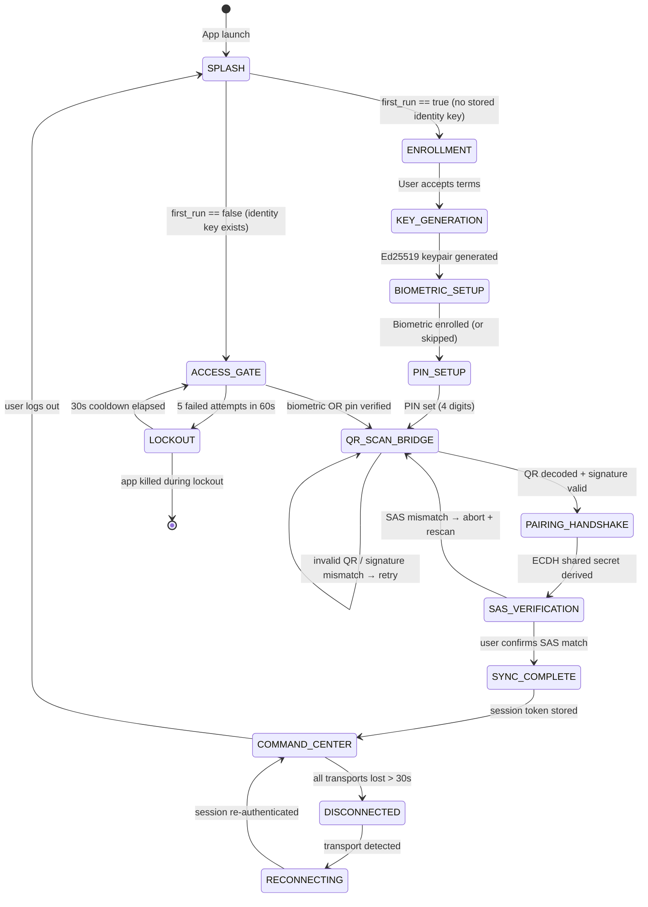
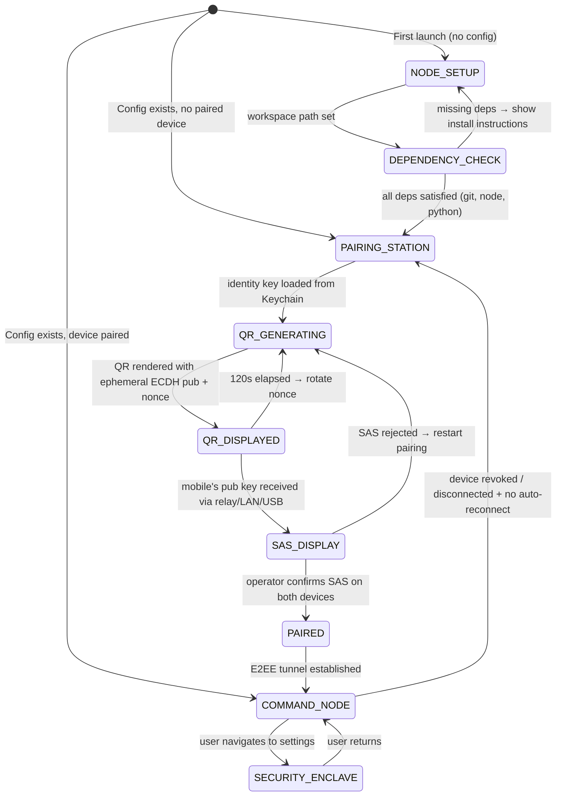
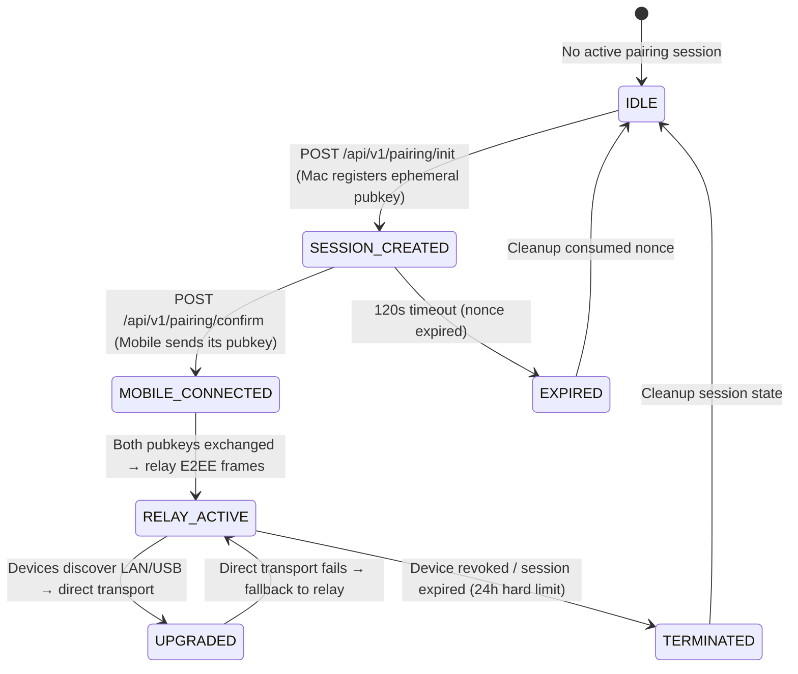

# Section 14.2 — Senior Architectural Review & Ratification

## Supreme Lead Architect: Claude Opus 4.6 (Thinking)
## Date: 2026-09-13T12:15:00+05:30
## Round: 2 (Critique of Gemini 3.1 Pro High Round 1 Proposal)
## Scope: Mac Desktop Application + Mobile Companion QR Pairing + Production Backend

---

## 1. Senior Critique & Gap Analysis of Round 1 Proposal

### 1.1 What Round 1 Got Right

The Gemini Pro High proposal correctly identifies the **three-tier topology** (Mac Desktop Node → Cloud Backend → Mobile Companion), the cryptographic foundation (ECDH P-256 + Ed25519), and the 120s QR rotation cycle. These fundamentals are sound and will be retained.

### 1.2 Critical Gaps & Threat Vectors Identified

> [!CAUTION]
> The following are P0/P1 architectural gaps in the Round 1 proposal that MUST be resolved before ratification.

#### GAP-1: QR Interception on Shared Screens (P0 — Attack Surface)

**Threat:** During video calls, screen shares, or multi-monitor setups, an attacker who captures the QR code image can extract the ephemeral public key and nonce. The Round 1 proposal has **no out-of-band verification** — scanning the QR alone completes pairing.

**Attack Scenario:**
```
1. Founder shares Mac screen on Google Meet
2. Attacker screenshots QR code during the 120s window
3. Attacker's app scans the QR, initiates pairing with the backend relay
4. Backend forwards attacker's public key to Mac
5. Mac derives shared secret with ATTACKER, not founder
6. E2EE tunnel established between Mac and ATTACKER
```

**Required Mitigation — Short Numeric Verification Code (SAS):**
After the ECDH key exchange completes, both devices independently compute a **4-digit Short Authentication String (SAS)** from the shared secret:

```python
# SAS derivation (deterministic, both sides compute independently)
sas = HKDF(
    shared_secret,
    salt=nonce,
    info=b"alphabrain-sas-v1",
    length=2
)
# Display as 4-digit decimal: "7392"
display_code = int.from_bytes(sas, 'big') % 10000
```

Mac displays: `VERIFY: 7392`
Mobile displays: `CONFIRM CODE ON MAC: 7392`

The founder visually confirms the codes match. If they don't match → MITM detected → pairing aborted.

> [!IMPORTANT]
> The SAS verification step is **mandatory for first-time pairing** and **optional for re-pairing** a previously trusted device (identified by its Ed25519 identity key fingerprint stored in the Mac's Keychain).

#### GAP-2: Missing Routing Precedence (P1 — Operational)

Round 1 specifies cloud relay but ignores the **three transport tiers** that AlphaBrain already supports:

| Priority | Transport | Condition | Latency |
|----------|-----------|-----------|---------|
| **1 (Preferred)** | USB ADB Port Forward | `adb forward tcp:8420 tcp:8420` — device physically connected | <5ms |
| **2 (LAN)** | Local WiFi mDNS/Bonjour | Both devices on same LAN, `_alphabrain._tcp.local.` service discovery | 5-50ms |
| **3 (Fallback)** | Cloud WebSocket Relay | Internet-connected, relay through `wss://api.alphabrain.com/v1/pairing/relay` | 50-300ms |

**Discovery Protocol:**
```
1. Mobile checks USB tunnel (localhost:8420 health endpoint)
   → If reachable: USE USB TRANSPORT (skip cloud entirely)
2. Mobile broadcasts mDNS query for _alphabrain._tcp.local.
   → If Mac responds: USE LAN TRANSPORT
3. Fallback: Connect to cloud relay
```

The QR payload must include all three transport hints:

```json
{
  "node_id": "uuid-v4",
  "usb_port": 8420,
  "lan_host": "192.168.1.42",
  "lan_port": 8420,
  "relay_url": "wss://api.alphabrain.com/v1/pairing/relay",
  "pub_key": "<Base64_ECDH_P256_Pub>",
  "nonce": "<Base64_120s_Nonce>",
  "sig": "<Ed25519_Sig_Over_All_Above>",
  "v": 1
}
```

#### GAP-3: Offline / Degraded Connectivity Behavior (P1 — Resilience)

Round 1 has **no specification** for what happens when:

- Internet drops but Mac and phone are on same LAN → **LAN transport takes over silently**
- Internet drops and no LAN → **USB transport if cable connected, otherwise DISCONNECTED state with auto-reconnect**
- Mac sleeps / lid close → **Session suspended, 30s grace period, then DISCONNECTED**

**Required State Machine for Connection Health:**

```
CONNECTED ──(internet_lost + lan_available)──→ CONNECTED_LAN
CONNECTED ──(internet_lost + usb_available)──→ CONNECTED_USB
CONNECTED ──(all_transports_lost)──→ RECONNECTING
CONNECTED_LAN ──(internet_restored)──→ CONNECTED
CONNECTED_USB ──(internet_restored)──→ CONNECTED
RECONNECTING ──(30s_timeout)──→ DISCONNECTED
DISCONNECTED ──(any_transport_found)──→ RECONNECTING
RECONNECTING ──(transport_established)──→ CONNECTED
```

#### GAP-4: Mac Application Technology Gap (P0 — Design)

Round 1 proposes **Tauri (Rust core)** for the Mac app. This is architecturally inconsistent:

1. AlphaBrain's entire backend is **Python + FastAPI**. Introducing Rust adds a second systems language.
2. The mobile app uses **React + Vite + Capacitor**. The Mac app should share the UI framework.
3. Tauri requires maintaining a separate Rust-based command system for IPC.

**Revised Mac Desktop Stack:**

| Layer | Technology | Rationale |
|-------|-----------|-----------|
| **Desktop Shell** | Electron 34+ | Full Node.js runtime for spawning `agy` CLI, `git`, and `python` subprocesses. macOS Keychain via `keytar`. |
| **UI Framework** | React 19 + Vite | Shared with mobile app — identical component system and design tokens. |
| **Styling** | Tailwind CSS (DeployMate Locomotive) | Exact same tokens as §14.3. |
| **QR Generation** | `qrcode` npm package | Client-side QR rendering with ECDH public key payload. |
| **Crypto** | Web Crypto API (P-256) + `@noble/ed25519` | Browser-native ECDH + proven Ed25519 library. |
| **Local Server** | Express.js (embedded) | Lightweight HTTP + WebSocket server for mobile pairing endpoint on port 8420. |

> [!WARNING]
> **Why not Tauri:** Tauri's Rust core requires FFI bridges to call Python, has limited macOS Keychain integration compared to Electron's `keytar`, and introduces build complexity (Cargo + npm + Python toolchain). Electron's overhead is acceptable for a founder-only desktop control node — this is not a consumer app with 10M users.

#### GAP-5: QR Payload Signature Verification Incomplete (P1 — Crypto)

Round 1 states "Mobile scans, validates signature" but does NOT specify:

- **What public key does the mobile use to verify the Ed25519 signature?**
- How does the mobile know the Mac's identity key on first contact?

**Resolution — Trust-On-First-Use (TOFU) with Fingerprint Pinning:**

1. First pairing: Mobile accepts the Mac's Ed25519 identity public key from the QR (TOFU)
2. Mobile stores the fingerprint: `SHA-256(identity_pub_key)[:16]` in Capacitor Preferences
3. Subsequent pairings: Mobile verifies the QR signature against the pinned fingerprint
4. Fingerprint mismatch → **ALERT: "Node identity changed! Possible impersonation."** → User must explicitly trust the new key

#### GAP-6: Missing Biometric Enclave Integration (P1 — Security)

Round 1 mentions "biometric confirmation toggles" but has no architecture for how biometric keys are stored:

**Mac Side:**
- Ed25519 identity key stored in **macOS Keychain** (`kSecClassKey`, `kSecAttrAccessibleWhenUnlockedThisDeviceOnly`)
- Touch ID gate on Keychain access via `kSecAccessControlBiometryCurrentSet`

**Mobile Side:**
- Ed25519 identity key stored in **Android Keystore** (`setUserAuthenticationRequired(true)`)
- Biometric prompt via Capacitor `@aparajita/capacitor-biometric-auth`
- PIN fallback (4-digit, as shown in user's Access Gate design)

#### GAP-7: Replay Window Missing (P1 — Crypto)

Round 1 specifies 120s nonce rotation but has no **monotonic counter** or **nonce replay table**:

**Required:** Backend maintains a set of consumed nonces with TTL = 300s (2.5× rotation window). Any nonce presented twice within the TTL window is rejected as a replay. Nonces older than 300s are garbage collected.

```python
class NonceRegistry:
    def __init__(self, ttl_seconds: int = 300):
        self._consumed: dict[str, float] = {}  # nonce → timestamp
        self._ttl = ttl_seconds
    
    def consume(self, nonce: str) -> bool:
        """Returns True if nonce is fresh, False if replayed."""
        self._gc()
        if nonce in self._consumed:
            return False  # REPLAY DETECTED
        self._consumed[nonce] = time.monotonic()
        return True
    
    def _gc(self):
        now = time.monotonic()
        self._consumed = {k: v for k, v in self._consumed.items() if now - v < self._ttl}
```

#### GAP-8: Device Revocation Protocol Missing (P0 — Security)

If the founder's phone is stolen, there's **no mechanism to revoke** the paired device's access.

**Required — Mac-Side Revocation:**

1. Mac maintains a `trusted_devices.json` in `~/.alphabrain/`:
   ```json
   [
     {
       "device_id": "uuid",
       "fingerprint": "sha256:abcd1234...",
       "paired_at": "2026-09-13T12:00:00Z",
       "last_seen": "2026-09-13T12:10:00Z",
       "revoked": false
     }
   ]
   ```

2. Revocation command: `alphabrain device revoke <device_id>`
3. Revoked devices are rejected at the WebSocket authentication layer immediately
4. The device's shared secret is zeroed from the Mac's Keychain

---

## 2. Formal State Machine Invariants

### 2.1 Mobile Application State Machine



### 2.2 Mac Desktop Application State Machine



### 2.3 Backend Pairing State Machine



### 2.4 Binding Invariants (Cross-System)

| ID | Invariant | Enforcement |
|----|-----------|-------------|
| **SM-1** | Mobile CANNOT reach `COMMAND_CENTER` without passing through either `ENROLLMENT` (first-run) or `ACCESS_GATE` (returning user) | State machine: no edge from `SPLASH` to `COMMAND_CENTER` |
| **SM-2** | Mobile CANNOT reach `SYNC_COMPLETE` without `SAS_VERIFICATION` passing | State machine: `PAIRING_HANDSHAKE` → `SAS_VERIFICATION` → `SYNC_COMPLETE` is the only path |
| **SM-3** | Mac CANNOT transition from `QR_DISPLAYED` to `PAIRED` without SAS confirmation | State machine: `SAS_DISPLAY` is mandatory intermediate state |
| **SM-4** | Backend session CANNOT exist without a consumed nonce in the replay registry | `NonceRegistry.consume()` is called atomically during `SESSION_CREATED` transition |
| **SM-5** | A revoked device CANNOT re-establish an E2EE tunnel without re-pairing from scratch | `trusted_devices.json` revocation flag checked at WebSocket auth layer |
| **SM-6** | QR nonce rotation MUST happen at 120s intervals — the Mac UI countdown ring is synchronized to this rotation | QR generation timer fires at 120s; `nonce` field changes; QR re-renders |
| **SM-7** | `LOCKOUT` state requires 30s cooldown before `ACCESS_GATE` re-entry — no bypass path exists | Cooldown timer in state machine; no user action can skip it |

---

## 3. Security & Cryptographic Ratification

### 3.1 Cryptographic Primitive Selection

| Primitive | Algorithm | Key Size | Purpose |
|-----------|-----------|----------|---------|
| **Key Agreement** | ECDH over P-256 (NIST) | 256-bit | Derive shared secret for E2EE tunnel |
| **Identity Signing** | Ed25519 (Curve25519) | 256-bit | Sign QR payloads, authenticate device identity |
| **Key Derivation** | HKDF-SHA256 | 256-bit output | Derive symmetric keys from ECDH shared secret |
| **Symmetric Encryption** | AES-256-GCM | 256-bit | Encrypt E2EE WebSocket frames |
| **Nonce** | `os.urandom(16)` | 128-bit | QR freshness; replay prevention |
| **SAS** | HKDF → 2 bytes → decimal | 4 digits | Visual MITM detection |

### 3.2 Key Hierarchy

```
Mac Identity Key (Ed25519, permanent, Keychain-stored)
  ├── Signs QR payloads (proof of Mac identity)
  └── Fingerprint stored on Mobile after first pairing (TOFU)

Mac Ephemeral Key (ECDH P-256, per-QR, 120s TTL)
  └── Combined with Mobile Ephemeral Key → Shared Secret

Shared Secret (ECDH output)
  ├── HKDF(info="alphabrain-sas-v1") → SAS (4 digits)
  ├── HKDF(info="alphabrain-e2ee-c2s-v1") → Client→Server AES-256-GCM key
  ├── HKDF(info="alphabrain-e2ee-s2c-v1") → Server→Client AES-256-GCM key
  └── HKDF(info="alphabrain-session-v1") → Session token seed

Mobile Identity Key (Ed25519, permanent, Android Keystore)
  ├── Signs pairing confirmation (proof of Mobile identity)
  └── Fingerprint stored on Mac after first pairing (TOFU)
```

### 3.3 Biometric Enclave Binding

**macOS (Mac Desktop):**
- Keychain item: `com.alphabrain.identity.ed25519`
- Access control: `kSecAccessControlBiometryCurrentSet` — Touch ID required to read private key
- Fallback: macOS user password (system keychain unlock)

**Android (Mobile Companion):**
- Android Keystore alias: `alphabrain_identity_ed25519`
- `setUserAuthenticationRequired(true)` — biometric required per use
- `setUserAuthenticationValidityDurationSeconds(0)` — no grace period
- Capacitor plugin: `@aparajita/capacitor-biometric-auth` wrapping `BiometricPrompt`

### 3.4 Replay Prevention

| Layer | Mechanism | Window |
|-------|-----------|--------|
| QR Nonce | 128-bit random, rotates every 120s | 120s validity |
| Backend Nonce Registry | Consumed nonces tracked with 300s TTL | 300s (2.5× rotation) |
| WebSocket Frames | Monotonic sequence counter per session, AES-GCM nonce-counter | Session lifetime |
| Session Token | JWT with `exp` claim, 24h maximum, sliding window | 24h hard, 1h sliding |

### 3.5 Revocation Protocol

```
1. Founder executes: `alphabrain device revoke <device_id>`
2. Mac:
   a. Sets `revoked: true` in trusted_devices.json
   b. Zeroes shared secret material from Keychain
   c. Closes active WebSocket tunnel to revoked device (RST)
   d. Emits DEVICE_REVOKED structured log event
3. Backend (if cloud relay active):
   a. Invalidates session JWT for revoked device
   b. Closes relay WebSocket for revoked device
4. Mobile (on next connection attempt):
   a. Receives 401 Unauthorized
   b. Transitions to DISCONNECTED state
   c. Must re-pair from scratch (full QR scan + SAS)
```

---

## 4. Mac Desktop Canonical Screens (M-01 through M-04)

### M-01: Node Setup

**Purpose:** Initial configuration for connecting to AlphaBrain backend, validating local dependencies, and setting workspace paths.

**Layout:**
```
┌─────────────────────────────────────────────────────────────┐
│  M-01 // NODE SETUP                          STAGE 1/4     │
│─────────────────────────────────────────────────────────────│
│                                                             │
│  ┌─── WORKSPACE PATH ─────────────────────────────────────┐ │
│  │ ~/Desktop/projects/alphaBrain              [BROWSE]    │ │
│  └────────────────────────────────────────────────────────┘ │
│                                                             │
│  ┌─── DEPENDENCY CHECK ──────────────────────────────────┐ │
│  │  ● Git 2.45.0            ✅ VERIFIED                  │ │
│  │  ● Node 22.8.0           ✅ VERIFIED                  │ │
│  │  ● Python 3.12.4         ✅ VERIFIED                  │ │
│  │  ● agy CLI 2.1.0         ✅ VERIFIED                  │ │
│  └────────────────────────────────────────────────────────┘ │
│                                                             │
│  ┌─── BACKEND CONNECTION ────────────────────────────────┐ │
│  │  API Endpoint: http://localhost:8000                   │ │
│  │  Status: ● CONNECTED (4ms)                            │ │
│  └────────────────────────────────────────────────────────┘ │
│                                                             │
│  [══════════════ PROCEED TO PAIRING ═══════════════════]    │
│                                                             │
│  DEPLOYMATE // ALPHABRAIN DESKTOP v1.0                      │
└─────────────────────────────────────────────────────────────┘
```

**Interactions:**
- [BROWSE] opens native macOS file picker for workspace directory
- Dependency check runs on mount: `which git`, `which node`, `python3 --version`, `which agy`
- Failed deps show ❌ with install instructions
- [PROCEED TO PAIRING] enabled only when all 4 deps verified + backend reachable

---

### M-02: Pairing Station

**Purpose:** High-contrast UI displaying the rotating QR code with 120s countdown ring and SAS verification code.

**Layout:**
```
┌─────────────────────────────────────────────────────────────┐
│  M-02 // PAIRING STATION                     ACTIVE        │
│─────────────────────────────────────────────────────────────│
│                                                             │
│  ┌─── SCAN WITH ALPHABRAIN COMPANION ────────────────────┐ │
│  │                                                        │ │
│  │     ┌────────────────────────────────────────┐         │ │
│  │     │  ┌──                            ──┐    │         │ │
│  │     │  │                                │    │         │ │
│  │     │  │         [QR CODE HERE]         │    │  ◐ 87s  │ │
│  │     │  │     256×256 high-contrast      │    │         │ │
│  │     │  │                                │    │         │ │
│  │     │  └──                            ──┘    │         │ │
│  │     └────────────────────────────────────────┘         │ │
│  │                                                        │ │
│  │  NODE: AB-MACBOOK-PRO-M4                               │ │
│  │  STATUS: ● AWAITING MOBILE SCAN                        │ │
│  └────────────────────────────────────────────────────────┘ │
│                                                             │
│  ┌─── VERIFICATION ──────────────────────────────────────┐ │
│  │                                                        │ │
│  │  VERIFY THIS CODE ON YOUR PHONE:                       │ │
│  │                                                        │ │
│  │       ╔════╗  ╔════╗  ╔════╗  ╔════╗                  │ │
│  │       ║  7 ║  ║  3 ║  ║  9 ║  ║  2 ║                  │ │
│  │       ╚════╝  ╚════╝  ╚════╝  ╚════╝                  │ │
│  │                                                        │ │
│  │  (Displayed only after mobile scans QR)                │ │
│  └────────────────────────────────────────────────────────┘ │
│                                                             │
│  ┌─ TRANSPORT ──────────────────────────────────────────┐   │
│  │  USB: ● AVAILABLE   LAN: ● AVAILABLE   RELAY: IDLE  │   │
│  └──────────────────────────────────────────────────────┘   │
└─────────────────────────────────────────────────────────────┘
```

**Interactions:**
- QR auto-regenerates every 120s with new ECDH ephemeral key + nonce
- Countdown ring (circular progress) shows time remaining
- SAS verification section appears ONLY after mobile scan detected
- Transport status bar shows real-time availability of USB/LAN/Relay
- After SAS confirmed → auto-navigate to M-03

---

### M-03: Desktop Command Node

**Purpose:** Primary brutalist dashboard showing active agent tasks, live terminal logs, resource utilization, and git branch states.

**Layout:**
```
┌─────────────────────────────────────────────────────────────┐
│  M-03 // COMMAND NODE                     ● SYSTEM LIVE    │
│─────────────────────────────────────────────────────────────│
│                                                             │
│  ┌─ ACTIVE TASKS ───────────────────────────────────┐      │
│  │ ┌───────────────────────────────────────────────┐ │      │
│  │ │ ● tsk_f92e9acb  Fix ruff lint...    EXECUTING │ │      │
│  │ │   alpha/tsk_f92e  ██████░░ 62%  4m12s         │ │      │
│  │ ├───────────────────────────────────────────────┤ │      │
│  │ │ ○ tsk_a4b2c3d1  Add rate limiter   APPROVED  │ │      │
│  │ │   Queued 2m ago                     Priority 2 │ │      │
│  │ └───────────────────────────────────────────────┘ │      │
│  └──────────────────────────────────────────────────┘      │
│                                                             │
│  ┌─ LIVE TERMINAL ──────────────────────────────────┐      │
│  │ [AGENT] Analyzing triage_queue.py for violations │      │
│  │ [SYS]   git status --porcelain -uall            │      │
│  │ [AGENT] Running acceptance gate: pytest -q ...   │      │
│  │ [SYS]   3/3 tests passed                        │      │
│  │ █                                                │      │
│  └──────────────────────────────────────────────────┘      │
│                                                             │
│  ┌─ SYSTEM ─────────────┐  ┌─ COMPANION ──────────────┐   │
│  │ CPU: ████░░░ 58%     │  │ 📱 Pixel 9a              │   │
│  │ RAM: █████░░ 72%     │  │ ● CONNECTED (USB 3ms)    │   │
│  │ DISK: ██░░░░ 31%     │  │ Last cmd: 14s ago        │   │
│  └──────────────────────┘  └──────────────────────────┘   │
│                                                             │
│  ┌─ GIT STATE ──────────────────────────────────────┐      │
│  │ main (a1b2c3d) ──┬── alpha/tsk_f92e (+4 files)  │      │
│  │                   └── alpha/tsk_a4b2 (pending)   │      │
│  └──────────────────────────────────────────────────┘      │
└─────────────────────────────────────────────────────────────┘
```

**Interactions:**
- Task rows are clickable → opens task detail panel
- Live terminal auto-scrolls; Ctrl+Click pauses
- System metrics polled every 5s (psutil)
- Companion section shows paired mobile device status
- Git state shows worktree branch tree from `git worktree list`

---

### M-04: Security Enclave

**Purpose:** Secure vault for managing API keys, biometric confirmation, device trust, and agent permission boundaries.

**Layout:**
```
┌─────────────────────────────────────────────────────────────┐
│  M-04 // SECURITY ENCLAVE                   🔒 LOCKED      │
│─────────────────────────────────────────────────────────────│
│  Touch ID required to access this section                   │
│                                                             │
│  ┌─ API KEYS ───────────────────────────────────────┐      │
│  │ Gemini AI Pro     ●●●●●●●●●●AQ.Ab8     [REVEAL] │      │
│  │ Claude Opus 4.6   ●●●●●●●●●●sk-ant    [REVEAL] │      │
│  │ GitHub PAT        ●●●●●●●●●●ghp_      [REVEAL] │      │
│  │ Vercel Token      ●●●●●●●●●●ver_      [REVEAL] │      │
│  └──────────────────────────────────────────────────┘      │
│                                                             │
│  ┌─ TRUSTED DEVICES ───────────────────────────────┐      │
│  │ 📱 Pixel 9a (10BF5P2AZF0010T)                   │      │
│  │    Fingerprint: sha256:7a3b...c12f               │      │
│  │    Paired: 2026-09-13 12:00                      │      │
│  │    Last seen: 14s ago                             │      │
│  │    [REVOKE DEVICE]                                │      │
│  └──────────────────────────────────────────────────┘      │
│                                                             │
│  ┌─ AGENT PERMISSIONS ─────────────────────────────┐      │
│  │ ☐ Auto-approve LOW priority tasks                │      │
│  │ ☑ Require biometric for EMERGENCY_STOP           │      │
│  │ ☑ Require biometric for API key reveal           │      │
│  │ ☐ Allow worker access to alpha_meet/ (BLOCKED)   │      │
│  └──────────────────────────────────────────────────┘      │
│                                                             │
│  ┌─ IDENTITY ──────────────────────────────────────┐      │
│  │ Node ID: AB-MACBOOK-PRO-M4                       │      │
│  │ Ed25519 Fingerprint: sha256:e4f2...9a1c          │      │
│  │ Key Storage: macOS Keychain (Secure Enclave)     │      │
│  └──────────────────────────────────────────────────┘      │
└─────────────────────────────────────────────────────────────┘
```

**Interactions:**
- Entire screen requires Touch ID to enter (biometric gate)
- [REVEAL] buttons show full key for 5s, then re-mask
- [REVOKE DEVICE] triggers the device revocation protocol (§3.5)
- Agent permission checkboxes write to `~/.alphabrain/config.json`
- Blocked permissions (alpha_meet/) show as disabled with tooltip explaining immutability (§4.1)

---

## 5. Mobile Companion Canonical Screens (15 Screens)

### MC-01: Splash Screen
- **Layout:** Stark white canvas. 3D Alpha mesh symbol centered. Bold "AlphaBrain" headline (Space Grotesk 600). "POWERED BY DeployMate" logo at bottom. 2s auto-handoff.
- **Interactions:** Auto-transition after 2s. Checks `Capacitor Preferences` for existing identity key → routes to MC-02A (first run) or MC-02B (returning).

### MC-02A: Enrollment (First Run)
- **Layout:** "01 // ENROLLMENT" header. "STAGE 1/3" badge. Ed25519 keypair generation progress indicator. Terms acceptance checkbox. "GENERATE IDENTITY" button.
- **Interactions:** Generates Ed25519 keypair → stores in Android Keystore. Biometric enrollment prompt. PIN setup (4 digits). Routes to MC-03.

### MC-02B: Access Gate (Returning User)
- **Layout:** "02 // ACCESS GATE" header. "STAGE 2/3" badge. "Founder Access" label. Touch ID box (centered square with fingerprint icon). 4 PIN entry boxes below. Numeric keypad with [AUTO] (red), [0], [⌫]. Bottom: "Instant Founder Biometric Unlock" button.
- **Interactions:** Touch ID auto-triggers on mount. PIN fallback on 3 biometric failures. 5 total failures → 30s LOCKOUT. Success → MC-03 (if no paired device) or MC-04 (if session exists).

### MC-03: QR Scanner Bridge
- **Layout:** "03 // QR SCANNER" header. "CONNECT HARDWARE" eyebrow. Full-screen camera viewfinder. Four #E6391E 90-degree corner brackets framing scan zone. "POINT AT MAC SCREEN" instruction text. Transport indicator bar at bottom (USB / LAN / RELAY).
- **Interactions:** Camera opens via `@nicolo-ribaudo/capacitor-barcode-scanner`. On successful decode → validate Ed25519 signature. Invalid → shake animation + retry. Valid → transition to MC-03B.

### MC-03B: SAS Verification
- **Layout:** "03B // VERIFY" header. "CONFIRM PAIRING" subtitle. Large 4-digit SAS code displayed in monospaced boxes. "DOES THE CODE ON YOUR MAC MATCH?" prompt. [CONFIRM ✓] and [DENY ✗] buttons.
- **Interactions:** [CONFIRM] → derive symmetric keys, establish E2EE tunnel, store session → MC-04. [DENY] → abort pairing, return to MC-03, display MITM warning.

### MC-04: Command Center (Dashboard)
- **Layout:** Strict list rows bounded by 1px solid #0A0A0A divider rules. Live pulse indicators for: System Live (green dot), AI Quotas (percentage), Active Projects (count), Triage Board (pending count). Connection status badge (USB/LAN/RELAY with latency). Quick-action buttons: [EMERGENCY STOP], [APPROVE NEXT].
- **Interactions:** Each row is a navigation target to deeper screens. Pull-to-refresh triggers full telemetry sync. EMERGENCY STOP requires biometric confirmation.

### MC-05: AI Quotas & Telemetry
- **Layout:** Account cards for each Gemini/Claude account. Circular progress rings showing quota remaining %. Reset countdown timer. Request velocity (RPM) sparkline. Provider logos.
- **Interactions:** Tap account card → expand to show per-model breakdown. Auto-refresh every 30s via `/api/quotas`.

### MC-06: Department Configurator
- **Layout:** Vertical list of departments (Engineering, Design, QA, DevOps). Each with agent count badge, active task indicator, and toggle switch.
- **Interactions:** Toggle enables/disables department. Tap row → navigate to department detail.

### MC-07: Agent Communication Hub
- **Layout:** Chat-style interface with agent message bubbles. Input bar at bottom. Agent selector dropdown at top.
- **Interactions:** Real-time WebSocket stream of agent thoughts. Can send text commands to agents.

### MC-08: Tech Department Overview
- **Layout:** Summary cards for active worktrees, test pass rate, lint status, recent commits. Mini git branch graph.
- **Interactions:** Tap worktree card → MC-09. Tap triage summary → MC-10.

### MC-09: GitHub Worktree Manager
- **Layout:** List of active worktrees with branch name, task ID, changed file count, status badge (EXECUTING/COMPLETED/FAILED). File diff preview on tap.
- **Interactions:** Tap worktree → expand to show changed files list. Long-press → option to clean up worktree.

### MC-10: Triage Task Board
- **Layout:** Three-column kanban-style board (scrollable): PENDING_REVIEW | APPROVED | EXECUTING. Task cards with priority badge, title, and timestamp.
- **Interactions:** Swipe right on PENDING → APPROVE. Swipe left → REJECT (requires reason). Tap card → MC-10B (task detail). Requires biometric for approve/reject.

### MC-11: Live Execution Stream
- **Layout:** Terminal-style black background. Monospaced green/white text. [AGENT] prefix in cyan, [SYS] in yellow. Auto-scrolling with scroll-lock toggle.
- **Interactions:** WebSocket stream from `/api/stream/{task_id}`. PAUSE/RESUME buttons. INTERRUPT button (triggers emergency stop with biometric gate).

### MC-12: Vercel Deployment Console
- **Layout:** Deployment cards with status badge (BUILDING/READY/ERROR), commit hash, duration, and deployment URL. Production vs Preview segmented control.
- **Interactions:** Tap deployment → expand to show build logs. Tap URL → open in browser.

### MC-13: Project Portfolio
- **Layout:** Grid of project cards with name, last activity timestamp, active status indicator (green/gray dot), and task count badge.
- **Interactions:** Tap project → filter dashboard to that project's tasks and worktrees.

### MC-14: Settings
- **Layout:** Grouped settings sections: Connection (transport preference), Security (biometric toggle, PIN change), Display (theme — always Locomotive), About (version, node ID, device fingerprint).
- **Interactions:** Transport preference: Auto / USB-Only / LAN-Only / Relay-Only. Biometric toggle writes to Capacitor Preferences. PIN change requires current PIN + biometric.

### MC-15: Session Expired / Re-Auth
- **Layout:** "SESSION EXPIRED" header. "Your session has timed out (24h limit)." message. [RE-AUTHENTICATE] button.
- **Interactions:** Triggers biometric → if session token is refreshable, silent re-auth. If revoked → navigate to MC-03 for full re-pairing.

---

## 6. Canonical Section 14.2 Markdown (For SENIOR_DIRECTIVE_AND_SYSTEM_DESIGN.md)

The complete Section 14.2 text is provided in the `finish` tool's `section_14_2_canonical_markdown` field and is ready to be appended after Section 14.1 in the architecture document.

---

> [!IMPORTANT]
> This review establishes invariants I-51 through I-62 for the Mac Desktop + Mobile Companion QR Pairing subsystem.

