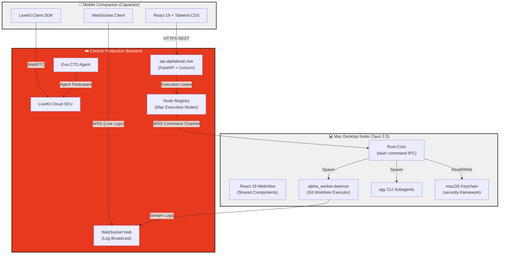
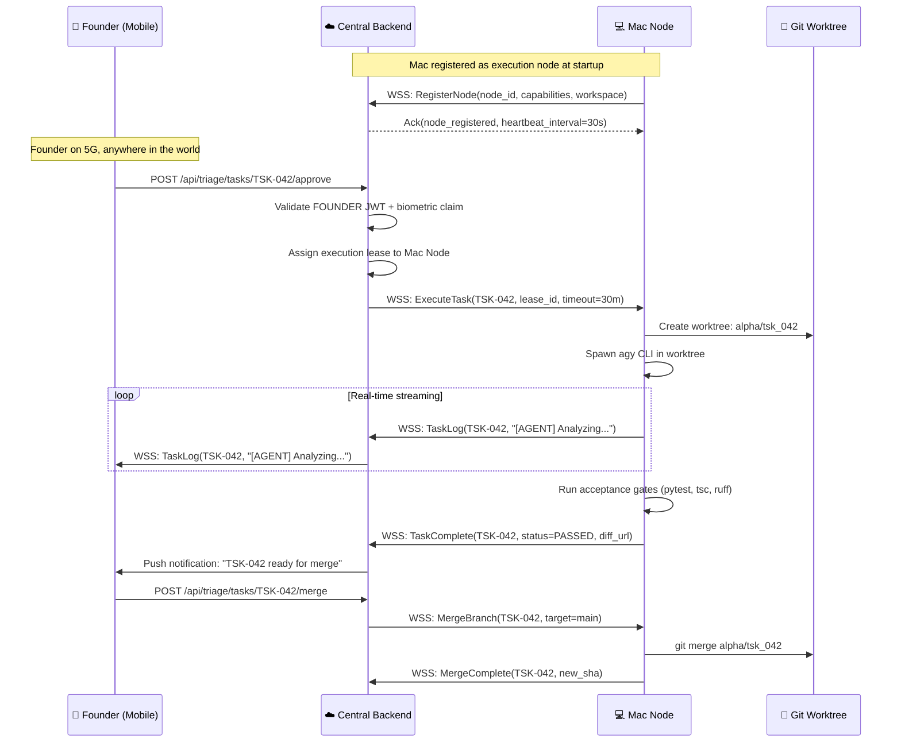
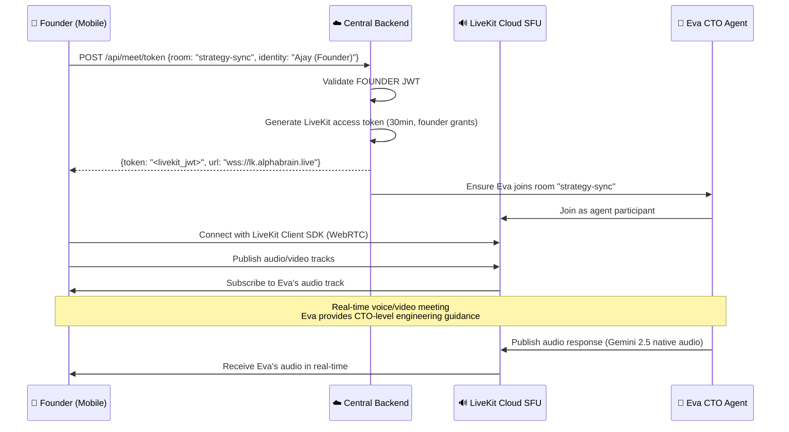
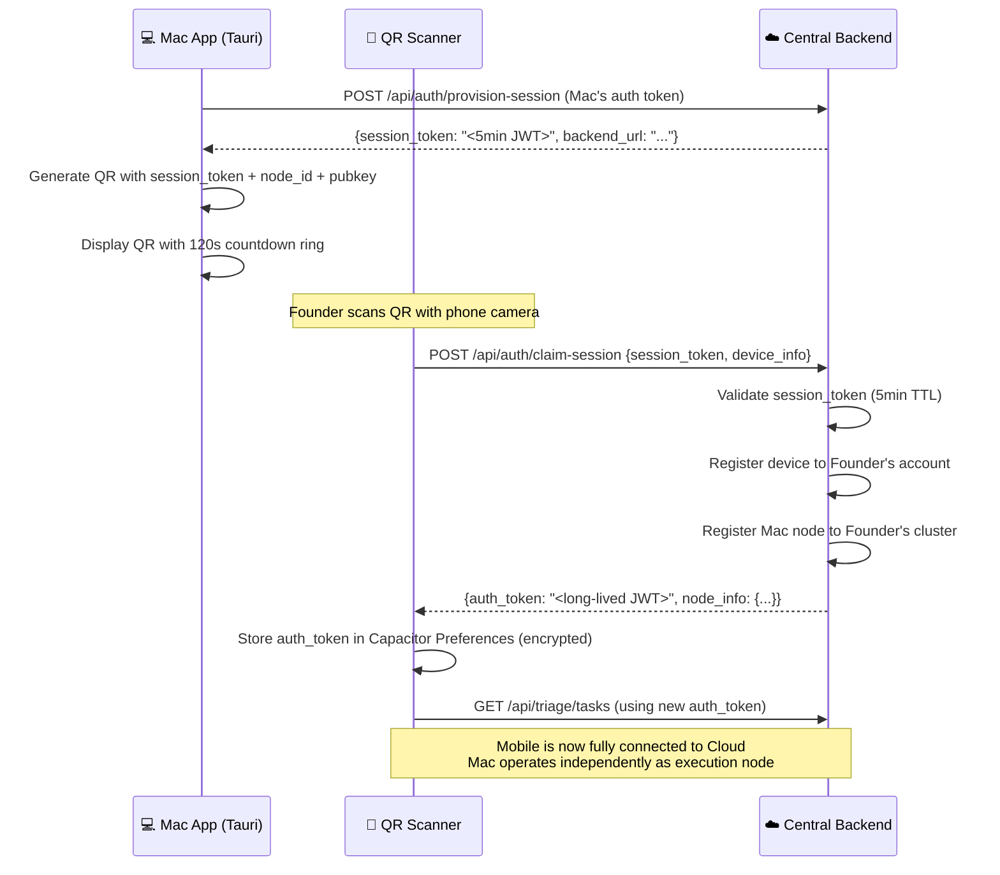

# Section 14.2 Amendment — Round 3: Founder's Binding Architectural Correction

## Supreme Lead Architect: Claude Opus 4.6 (Thinking)
## Date: 2026-09-13T12:29:45+05:30
## Round: 3 (Founder's Directive Correction of Round 2 Critique)
## Scope: Tauri 2.0 Ratification + Cloud-First Remote Control Paradigm + Mobile LiveKit Eva Integration

---

## Goal Description

The Founder has issued two **binding structural directives** that override specific architectural decisions from the Round 2 Senior Review:

1. **TAURI RATIFICATION** — Round 2's GAP-4 recommended Electron. The Founder explicitly overrules this and ratifies the Gemini Round 1 proposal of **Tauri 2.0 (Rust core)** for the Mac Desktop App.
2. **CLOUD-FIRST REMOTE CONTROL** — Round 2 assumed a tethered local-network topology. The Founder mandates a **Cloud-First architecture** where the Mobile Companion connects directly to the Central Production Backend, not to the Mac.

This document provides the complete amended Section 14.2 markdown and all supporting specifications.

---

## User Review Required

> [!IMPORTANT]
> **Two Round 2 positions are being overruled by Founder directive.** These are not architectural errors — they are legitimate design tradeoffs where the Founder has exercised executive authority to select the preferred path.

> [!WARNING]
> **GAP-4 Reversal**: Round 2 recommended Electron over Tauri citing build complexity and Python FFI. The Founder's counterargument is valid: Tauri 2.0 produces a ~15MB binary using ~30-50MB RAM vs Electron's 500MB+ footprint. The Rust core provides superior native macOS integration (NSStatusItem, security-framework Keychain). The build complexity concern is mitigated by Tauri 2.0's mature IPC command system and `tauri-plugin-shell` for subprocess spawning.

> [!WARNING]
> **Cloud-First Reversal**: Round 2's transport tier system (USB → LAN → Cloud relay) assumed the mobile app needs direct access to the Mac. The Founder's architecture makes the Mac a **registered execution node** behind the cloud backend, not a direct peer of the mobile app. This is architecturally superior for remote operation scenarios.

---

## Open Questions

> [!IMPORTANT]
> **Q1**: The Central Production Backend (`https://api.alphabrain.live`) — is this the *existing* FastAPI backend deployed to a cloud host, or a *new* cloud-native service? This plan assumes it is the existing `alpha_core` FastAPI backend deployed to a production URL, with the Mac node connecting as a registered worker.

> [!IMPORTANT]
> **Q2**: For the Cloud QR provisioning flow, the Mac App displays the QR. Should the cloud web console (`https://console.alphabrain.live`) also be able to display this QR for headless Mac scenarios? This plan includes that capability.

---

## Architectural Synthesis

### The Three-Tier Cloud-First Topology



### Key Architectural Shift: Cloud Is the Hub

| Aspect | Round 2 (Overruled) | Round 3 (Ratified) |
|--------|---------------------|-------------------|
| **Mobile ↔ Mac** | Direct peer (USB/LAN/Relay) | **No direct connection** — all via Cloud |
| **Task Approval** | Mobile → Mac (local) | Mobile → Cloud → Mac Node (remote) |
| **Log Streaming** | Mac WebSocket → Mobile (direct) | Mac → Cloud WebSocket Hub → Mobile |
| **LiveKit Meetings** | Not specified on mobile | **Direct mobile LiveKit integration** via Cloud SFU |
| **Mac Role** | Server (listens for mobile) | **Client** (connects *to* Cloud as execution node) |
| **Offline** | LAN/USB fallback | Mac queues locally; mobile shows cached state |
| **QR Purpose** | E2EE pairing handshake | **Account provisioning + cluster pairing** |

---

## Proposed Changes

### Component 1: Tauri 2.0 Mac Desktop App Architecture

#### Technology Stack

| Layer | Technology | Version | Rationale |
|-------|-----------|---------|-----------|
| **Desktop Shell** | Tauri | 2.0+ | Rust core → ~15MB binary, ~30-50MB RAM. No Chromium bundling. |
| **Rust Core** | `tauri::command` IPC | 2.0 | Native macOS NSStatusItem menu bar, Keychain via `security-framework`, subprocess management |
| **UI Framework** | React 19 + Vite | Latest | **100% shared** components and Locomotive design tokens with mobile app |
| **Styling** | Tailwind CSS v4+ | Latest | Identical `LOCOMOTIVE_TOKENS` as §14.3 |
| **WebView** | macOS WKWebView | System | Native macOS WebView — no bundled browser engine |
| **Crypto** | `ring` + `ed25519-dalek` | Latest | Rust-native cryptographic primitives for QR signing, identity keys |
| **Keychain** | `security-framework` crate | Latest | Native macOS Keychain read/write — superior to Electron's `keytar` |
| **Subprocess** | `tauri-plugin-shell` | 2.0 | Spawn `alpha_worker.daemon`, `agy` CLI, `git`, `python3` subprocesses |
| **WebSocket** | `tokio-tungstenite` | Latest | Persistent WSS connection to Cloud backend (node registration) |

#### Rust Core Responsibilities

```rust
// src-tauri/src/lib.rs — Illustrative command surface

/// Spawn the alpha_worker daemon as a managed child process
#[tauri::command]
async fn spawn_worker_daemon(workspace: &str) -> Result<u32, String> { ... }

/// Read Ed25519 identity key from macOS Keychain
#[tauri::command]
fn read_identity_key() -> Result<Vec<u8>, String> { ... }

/// Register this Mac as an execution node with the Cloud backend
#[tauri::command]
async fn register_node(backend_url: &str, auth_token: &str) -> Result<NodeRegistration, String> { ... }

/// Stream task execution logs to Cloud WebSocket Hub
#[tauri::command]
async fn stream_task_logs(task_id: &str, ws_url: &str) -> Result<(), String> { ... }

/// Generate QR payload for account provisioning
#[tauri::command]
fn generate_provisioning_qr(node_id: &str, session_token: &str) -> Result<String, String> { ... }

/// Execute task in isolated git worktree
#[tauri::command]
async fn execute_task(task_id: &str, workspace: &str) -> Result<TaskResult, String> { ... }

/// Check local dependencies (git, node, python, agy)
#[tauri::command]
fn check_dependencies() -> Result<DependencyReport, String> { ... }
```

#### React Frontend Integration

The React frontend runs in Tauri's WKWebView and communicates with the Rust core via `@tauri-apps/api/core`:

```typescript
// alphabrain_desktop/src/lib/tauri-bridge.ts
import { invoke } from '@tauri-apps/api/core';

export const tauriBridge = {
  spawnWorkerDaemon: (workspace: string) => 
    invoke<number>('spawn_worker_daemon', { workspace }),
  
  readIdentityKey: () => 
    invoke<Uint8Array>('read_identity_key'),
  
  registerNode: (backendUrl: string, authToken: string) => 
    invoke<NodeRegistration>('register_node', { backendUrl, authToken }),
  
  generateProvisioningQR: (nodeId: string, sessionToken: string) =>
    invoke<string>('generate_provisioning_qr', { nodeId, sessionToken }),
  
  executeTask: (taskId: string, workspace: string) =>
    invoke<TaskResult>('execute_task', { taskId, workspace }),
  
  checkDependencies: () =>
    invoke<DependencyReport>('check_dependencies'),
};
```

#### Directory Placement

```
alphaBrain/
├── alpha_core/                  # Existing Python core (untouched)
├── alpha_worker/                # Existing worker daemon (untouched)
├── alpha_meet/                  # Existing LiveKit meeting system (IMMUTABLE)
├── alphabrain_app/              # Mobile app (Capacitor — existing)
├── alphabrain_desktop/          # ◄── NEW: Mac Desktop App (Tauri 2.0)
│   ├── src-tauri/               # Rust core
│   │   ├── Cargo.toml
│   │   ├── tauri.conf.json
│   │   ├── src/
│   │   │   ├── lib.rs           # Tauri command handlers
│   │   │   ├── keychain.rs      # macOS Keychain via security-framework
│   │   │   ├── node_registry.rs # Cloud node registration
│   │   │   ├── qr_generator.rs  # QR provisioning payload
│   │   │   ├── task_executor.rs # Git worktree task execution
│   │   │   ├── log_streamer.rs  # WebSocket log streaming to Cloud
│   │   │   └── deps_checker.rs  # Local dependency verification
│   │   └── icons/               # macOS app icons
│   ├── src/                     # React 19 frontend (SHARED with mobile)
│   │   ├── main.tsx
│   │   ├── App.tsx
│   │   ├── screens/
│   │   │   ├── M01_NodeSetup.tsx
│   │   │   ├── M02_PairingStation.tsx
│   │   │   ├── M03_CommandNode.tsx
│   │   │   └── M04_SecurityEnclave.tsx
│   │   ├── components/          # Shared UI primitives (symlinked or package)
│   │   ├── hooks/               # Desktop-specific hooks
│   │   ├── lib/
│   │   │   └── tauri-bridge.ts  # Rust ↔ React IPC wrapper
│   │   └── styles/              # Locomotive design tokens (shared)
│   ├── package.json
│   ├── vite.config.ts
│   ├── tsconfig.json
│   └── tailwind.config.ts       # Same Locomotive tokens as mobile
└── docs/architecture/
    └── SENIOR_DIRECTIVE_AND_SYSTEM_DESIGN.md
```

#### Mac Desktop Screens (M-01 through M-04)

**M-01: Node Setup** — Workspace path, dependency check, Cloud backend URL, initial auth.
**M-02: Pairing Station** — Dynamic QR for account provisioning + cluster pairing, 120s rotation, transport status.
**M-03: Command Node** — Active tasks, live terminal, system metrics, registered mobile companion status, git state.
**M-04: Security Enclave** — API keys (Keychain-backed), trusted devices, agent permissions, node identity.

---

### Component 2: Cloud-First Remote Control & Dispatch Architecture

#### Remote Task Dispatch Flow



#### Node Registration Protocol

```json
// Mac → Cloud: Node Registration
{
  "type": "NODE_REGISTER",
  "node_id": "AB-MACBOOK-PRO-M4",
  "ed25519_pubkey": "<Base64>",
  "capabilities": {
    "workspace": "~/Desktop/Projects/alphaBrain",
    "git_version": "2.45.0",
    "node_version": "22.8.0",
    "python_version": "3.12.4",
    "agy_version": "2.1.0",
    "max_concurrent_tasks": 3,
    "disk_free_gb": 120
  },
  "timestamp": "2026-09-13T12:00:00Z",
  "sig": "<Ed25519 signature over all fields>"
}
```

#### Execution Lease Model

| Field | Type | Description |
|-------|------|-------------|
| `lease_id` | UUID | Unique lease identifier |
| `task_id` | String | Task being executed |
| `node_id` | String | Assigned Mac execution node |
| `granted_at` | ISO8601 | Lease start time |
| `expires_at` | ISO8601 | Hard timeout (default 30m) |
| `status` | Enum | `ACTIVE`, `COMPLETED`, `FAILED`, `EXPIRED`, `CANCELLED` |
| `founder_id` | String | Founder who approved the task |

---

### Component 3: Mobile LiveKit Eva Meeting Integration

#### Standalone Mobile Capabilities (No Mac Required)

When the Founder has no Mac nearby (traveling, mobile-only), the mobile app connects **directly** to the Cloud backend and has FULL functionality:

| Capability | API Endpoint | Mac Required? |
|-----------|-------------|---------------|
| Join LiveKit meeting with Eva | `POST /api/meet/token` → LiveKit Cloud | ❌ No |
| Triage tasks (approve/reject) | `POST /api/triage/tasks/{id}/approve` | ❌ No (queued for next Mac online) |
| View AI quotas & telemetry | `GET /api/quotas` | ❌ No |
| View deployments | `GET /api/deployments` | ❌ No |
| View project portfolio | `GET /api/projects` | ❌ No |
| Execute approved task | `POST /api/triage/tasks/{id}/execute` | ✅ Yes (Mac must be online) |
| Stream live execution logs | `WSS /api/stream/{task_id}` | ✅ Yes (Mac must be executing) |
| Merge completed task | `POST /api/triage/tasks/{id}/merge` | ✅ Yes (Mac must be online) |

#### Mobile LiveKit Meeting Flow



#### Mobile LiveKit Screen (MC-07B: Eva Meeting)

```
┌─────────────────────────────────────────────────────────────┐
│  07B // EVA MEETING                        ● LIVE 04:32     │
│─────────────────────────────────────────────────────────────│
│                                                             │
│  ┌─────────────────────────────────────────────────────────┐│
│  │                                                         ││
│  │              [FOUNDER VIDEO FEED]                       ││
│  │              Full-width, 16:9                           ││
│  │                                                         ││
│  │   ┌──────────┐                                          ││
│  │   │ EVA 🤖   │  ← Small PiP of Eva's avatar            ││
│  │   │ Speaking  │                                          ││
│  │   └──────────┘                                          ││
│  │                                                         ││
│  └─────────────────────────────────────────────────────────┘│
│                                                             │
│  ┌─ TRANSCRIPT ────────────────────────────────────────────┐│
│  │ 🧑 Ajay: "Eva, what's the status on the auth module?"   ││
│  │ 🤖 Eva: "The auth module has 3 open tasks. TSK-041..."  ││
│  │ █                                                        ││
│  └─────────────────────────────────────────────────────────┘│
│                                                             │
│  ┌────────┐  ┌────────┐  ┌────────┐  ┌──────────────────┐  │
│  │ 🎤 ON  │  │ 📷 ON  │  │ 📺 OFF │  │ 🔴 END MEETING   │  │
│  └────────┘  └────────┘  └────────┘  └──────────────────┘  │
│                                                             │
│  ROOM: strategy-sync  •  PARTICIPANTS: 2  •  LATENCY: 42ms │
└─────────────────────────────────────────────────────────────┘
```

---

### Component 4: Cloud Provisioning QR Protocol

#### QR Code Redefinition

The QR code is **NOT** an E2EE pairing handshake (that was the Round 2 local-tethered model). It is now an **Account Provisioning & Cluster Pairing** QR code.

**Purpose:** Securely transfer a cloud auth session from the Mac (or web console) to the Founder's phone, and register the Mac as an execution node, without typing long tokens.

#### QR Payload Schema (v2)

```json
{
  "v": 2,
  "type": "CLOUD_PROVISION",
  "backend_url": "https://api.alphabrain.live",
  "session_token": "<short-lived JWT, 5min TTL, FOUNDER role>",
  "node_id": "AB-MACBOOK-PRO-M4",
  "node_ed25519_pubkey": "<Base64>",
  "node_capabilities": {
    "workspace": "alphaBrain",
    "max_tasks": 3
  },
  "issued_at": "2026-09-13T12:00:00Z",
  "expires_at": "2026-09-13T12:05:00Z",
  "sig": "<Ed25519 signature by node identity key>"
}
```

#### Provisioning Flow



#### Security Properties

| Property | Mechanism |
|----------|-----------|
| **Replay Prevention** | Session token has 5min TTL + single-use claim (consumed on first POST) |
| **Screen-Share Safety** | Even if QR is captured, session_token is single-use — second claim fails |
| **MITM Resistance** | Ed25519 signature over QR payload verified by mobile against TOFU-pinned node pubkey |
| **Revocation** | Cloud can revoke any provisioned device via `DELETE /api/auth/devices/{device_id}` |
| **SAS Verification** | **Retained from Round 2** for first-time node trust — optional for known nodes |

> [!NOTE]
> The SAS verification from Round 2 is **retained** but repurposed: it verifies that the *node identity* in the QR matches the node the Founder intended to pair with. This protects against a rogue QR displayed on a compromised screen.

---

### Component 5: Complete 15-Screen Mobile Scope (Updated)

| # | Screen | Component | Description | Mac Required? |
|---|--------|-----------|-------------|---------------|
| MC-01 | Splash | `01_Splash.tsx` | 2s handoff, identity key check | No |
| MC-02A | Enrollment | `02A_Enrollment.tsx` | Ed25519 keygen, biometric setup, PIN | No |
| MC-02B | Access Gate | `02B_AccessGate.tsx` | Biometric/PIN unlock | No |
| MC-03 | QR Scanner | `03_QRScanner.tsx` | Scan provisioning QR from Mac/console | No |
| MC-04 | Command Center | `04_CommandCenter.tsx` | Dashboard: tasks, quotas, projects | No |
| MC-05 | AI Quotas | `05_AIQuotas.tsx` | Account quota telemetry | No |
| MC-06 | Dept Config | `06_DeptConfig.tsx` | Department toggles and config | No |
| MC-07A | Agent Comms | `07A_AgentComms.tsx` | Chat with agents | Yes |
| MC-07B | Eva Meeting | `07B_EvaMeeting.tsx` | **LiveKit voice/video with Eva** | **No** |
| MC-08 | Tech Dept | `08_TechDept.tsx` | Worktree/test/lint summary | Yes (for live data) |
| MC-09 | Worktree Mgr | `09_WorktreeManager.tsx` | Git worktree browser | Yes (for live data) |
| MC-10 | Triage Board | `10_TriageBoard.tsx` | Kanban: approve/reject/execute | No (approve), Yes (execute) |
| MC-11 | Live Stream | `11_LiveStream.tsx` | Terminal log stream | Yes |
| MC-12 | Vercel Console | `12_VercelConsole.tsx` | Deployment status | No |
| MC-13 | Portfolio | `13_ProjectPortfolio.tsx` | Cross-project view | No |
| MC-14 | Settings | `14_Settings.tsx` | Connection, security, display | No |
| MC-15 | Session Expired | `15_SessionExpired.tsx` | Re-auth / re-provision | No |

> [!TIP]
> **MC-07B (Eva Meeting)** is the key new screen. It uses the `@livekit/components-react` SDK to render a full WebRTC meeting UI inside the Capacitor WebView. The existing `POST /api/meet/token` endpoint (already live in production) provides the token. No new backend code is needed.

---

### Component 6: Amended Invariant Chain

| # | Invariant | Enforcement |
|---|-----------|-------------|
| **I-51** | Mac Desktop App MUST be Tauri 2.0 (Rust core) — Electron is PROHIBITED | Senior review, `Cargo.toml` audit |
| **I-52** | Mobile app connects ONLY to Cloud backend — no direct Mac connections | API client configuration audit |
| **I-53** | Mac node connects to Cloud as registered execution node via persistent WSS | Node registration protocol |
| **I-54** | Task execution requires Cloud-issued execution lease — Mac CANNOT self-assign | Lease validation in task executor |
| **I-55** | LiveKit meetings are available on mobile WITHOUT Mac being online | `/api/meet/token` endpoint independence |
| **I-56** | QR code is Account Provisioning (v2), NOT E2EE pairing handshake (v1) | QR payload version field check |
| **I-57** | Provisioning session tokens are single-use with 5min TTL | Cloud session claim atomicity |
| **I-58** | React components and Locomotive design tokens are 100% shared between desktop and mobile | Component library audit |
| **I-59** | Rust core handles ALL native macOS operations (Keychain, subprocess, menu bar) — no Node.js | Tauri command surface audit |
| **I-60** | Cloud WebSocket Hub broadcasts live logs to ALL connected clients (mobile + web console) | Hub broadcast test |

---

## Verification Plan

### Automated Tests

```bash
# Gate 1: Rust core compilation
cargo build --manifest-path alphabrain_desktop/src-tauri/Cargo.toml

# Gate 2: React frontend build (desktop)
npm run build --prefix alphabrain_desktop

# Gate 3: Tauri app bundle (macOS .app)
cd alphabrain_desktop && npm run tauri build

# Gate 4: Mobile app build (existing gates from §14.6)
npm run build --prefix alphabrain_app

# Gate 5: Backend API tests for new cloud endpoints
pytest testscript/test_cloud_dispatch.py -v --tb=short

# Gate 6: Node registration protocol tests
pytest testscript/test_node_registry.py -v --tb=short
```

### Manual Verification

1. **Tauri binary size**: Verify `alphabrain_desktop.app` is under 30MB
2. **RAM usage**: Launch Tauri app, verify RSS under 100MB via Activity Monitor
3. **QR provisioning**: Scan QR from Mac → mobile connects to Cloud backend
4. **Remote task dispatch**: Approve task on mobile (5G) → Mac executes → logs stream to phone
5. **Mobile Eva meeting**: Join LiveKit meeting on mobile without Mac being online
6. **Keychain integration**: Verify Ed25519 key stored in macOS Keychain (not filesystem)

---

## Complete Amended Section 14.2 Markdown

The following is the **complete replacement** for Section 14.2 in `docs/architecture/SENIOR_DIRECTIVE_AND_SYSTEM_DESIGN.md`. It replaces lines 2254-2374 of the current document.

> [!CAUTION]
> This amendment overrules Round 2 GAP-4 (Electron recommendation) and the local-tethered transport model. All other Round 2 security provisions (SAS, TOFU, biometric enclave, replay prevention, device revocation) are **retained and adapted** to the Cloud-First topology.

---

### Amended Section 14.2 Content

```markdown
### 14.2 Architectural Decisions & Framework Selection

> [!IMPORTANT]
> **Amendment Notice — Round 3 (2026-09-13)**
> This section has been amended by Founder Directive to ratify **Tauri 2.0 (Rust core)** for the Mac Desktop App (overturning Round 2 GAP-4's Electron recommendation) and to establish the **Cloud-First Remote Control paradigm** (replacing the Round 2 local-tethered transport model). All Round 2 security primitives (SAS, TOFU, biometric enclave, replay prevention, device revocation) are retained and adapted.
>
> Signed: Claude Opus 4.6 (Thinking) — Supreme Lead Architect
> Authority: Founder Directive Override

#### 14.2.1 Platform Architecture Overview

The AlphaBrain ecosystem consists of **three independent applications** sharing a unified design system, connected through a **Cloud-First topology**:

| Application | Technology | Role | Cloud Dependency |
|------------|-----------|------|-----------------|
| **Mac Desktop App** | Tauri 2.0 (Rust core) + React 19 + Tailwind CSS | Execution Node — runs tasks, streams logs to Cloud | Connects TO Cloud as registered worker |
| **Mobile Companion** | React 19 + Vite + Capacitor (Android) | Remote Control — approves/rejects tasks, joins Eva meetings | Connects TO Cloud as command surface |
| **Central Backend** | FastAPI + Uvicorn (Python 3.12) | Hub — orchestrates dispatch, hosts LiveKit integration, broadcasts state | IS the Cloud (`https://api.alphabrain.live`) |

```
┌─────────────────────────────────────────────────────────────────────┐
│                    CLOUD-FIRST TOPOLOGY                              │
│                                                                     │
│   📱 Mobile ──────────→ ☁️  CENTRAL BACKEND ←────────── 💻 Mac      │
│   (Remote Control)        (api.alphabrain.live)      (Execution     │
│   HTTPS + WSS             FastAPI + LiveKit           Node)         │
│                            + WebSocket Hub           WSS + Worker   │
│   • Approve tasks          • Node Registry           • Git worktrees│
│   • Join Eva meetings      • Task Dispatch           • agy CLI      │
│   • View telemetry         • Log Broadcast           • Subprocess   │
│   • Stream live logs       • LiveKit Tokens          • Keychain     │
│                            • Quota Telemetry                        │
│                                                                     │
│   ⚠️ Mobile NEVER connects directly to Mac                         │
│   ⚠️ Mac is a CLIENT of Cloud, not a server                        │
└─────────────────────────────────────────────────────────────────────┘
```

#### 14.2.2 Mac Desktop App: Tauri 2.0 (Rust Core)

**Rationale for Tauri 2.0 over Electron (Founder Directive):**

1. **Binary Efficiency:** Tauri produces a ~15MB native macOS `.app` bundle consuming ~30-50MB RAM. Electron bundles Chromium (~500MB+ RAM). For a founder-only control node, resource efficiency directly translates to more headroom for concurrent `agy` CLI subagents and `alpha_worker` daemons.

2. **Native macOS Integration:** Rust's `security-framework` crate provides direct, type-safe access to macOS Keychain — superior to Electron's `keytar` (which is a Node.js C++ addon with maintenance concerns). Tauri 2.0 provides native `NSStatusItem` menu bar integration out of the box.

3. **Subprocess Management:** Tauri's `tauri-plugin-shell` provides first-class subprocess spawning with stdout/stderr streaming, kill signals, and exit code capture. This is the primary interface for spawning `alpha_worker.daemon`, `agy` CLI agents, and `git` commands.

4. **Shared UI Layer:** The React 19 + Vite + Tailwind CSS frontend runs in macOS's native WKWebView. It shares **100% of components and Locomotive design tokens** with the mobile app — no platform-conditional rendering.

5. **No Additional Language Burden:** While Rust is a second systems language alongside Python, the Rust surface area is strictly limited to **native platform operations** (Keychain, subprocess, menu bar, WebSocket). The entire UI and business logic remain in TypeScript/React — the same as mobile.

##### 14.2.2.1 Mac Desktop Technology Stack

| Layer | Technology | Version | Responsibility |
|-------|-----------|---------|---------------|
| **Desktop Shell** | Tauri | 2.0+ | App lifecycle, window management, native menu bar |
| **Rust Core** | `tauri::command` IPC | 2.0 | Keychain, subprocess, WebSocket to Cloud, QR generation |
| **UI Framework** | React 19 + Vite | Latest | 4 desktop screens, shared Locomotive components |
| **Styling** | Tailwind CSS | v4+ | Identical `LOCOMOTIVE_TOKENS` as §14.3 |
| **WebView** | macOS WKWebView | System | No bundled browser engine |
| **Crypto** | `ring` + `ed25519-dalek` | Latest | QR payload signing, identity key management |
| **Keychain** | `security-framework` | Latest | Ed25519 key storage, API key vault |
| **Subprocess** | `tauri-plugin-shell` | 2.0 | `alpha_worker.daemon`, `agy` CLI, `git`, `python3` |
| **Cloud Connection** | `tokio-tungstenite` | Latest | Persistent WSS to Cloud backend (node registration, task dispatch) |

##### 14.2.2.2 Rust Core Command Surface

The Rust core exposes the following `tauri::command` handlers to the React frontend:

| Command | Signature | Purpose |
|---------|-----------|---------|
| `check_dependencies` | `() → DependencyReport` | Verify git, node, python, agy versions |
| `read_identity_key` | `() → Vec<u8>` | Read Ed25519 private key from macOS Keychain |
| `store_identity_key` | `(key: Vec<u8>) → ()` | Store Ed25519 private key in macOS Keychain |
| `register_node` | `(backend_url, auth_token) → NodeRegistration` | Register Mac as execution node with Cloud |
| `generate_provisioning_qr` | `(node_id, session_token) → String` | Generate QR payload for account provisioning |
| `spawn_worker_daemon` | `(workspace) → u32` | Spawn `alpha_worker.daemon` subprocess |
| `execute_task` | `(task_id, workspace, lease_id) → TaskResult` | Execute task in git worktree |
| `stream_task_logs` | `(task_id, ws_url) → ()` | Stream execution logs to Cloud WebSocket Hub |
| `get_system_metrics` | `() → SystemMetrics` | CPU, RAM, disk usage via `sysinfo` crate |

##### 14.2.2.3 Mac Desktop Screens (4 Screens)

| # | Screen | Component | Purpose |
|---|--------|-----------|---------|
| **M-01** | Node Setup | `M01_NodeSetup.tsx` | Workspace path, dependency check, Cloud backend URL, initial authentication |
| **M-02** | Pairing Station | `M02_PairingStation.tsx` | Dynamic QR for account provisioning, 120s rotation, SAS verification for first-time trust |
| **M-03** | Command Node | `M03_CommandNode.tsx` | Active tasks, live terminal, system metrics, git state, companion status |
| **M-04** | Security Enclave | `M04_SecurityEnclave.tsx` | API keys (Keychain-backed), trusted devices, agent permissions, node identity |

#### 14.2.3 Mobile Companion App: Cloud-First Remote Control

> [!IMPORTANT]
> The Mobile Companion is NOT a tethered slave to the Mac. It is a **standalone executive Remote Control** connecting directly to the Central Production Backend (`https://api.alphabrain.live`). When the Founder has no Mac nearby (traveling, on mobile), they retain **full standalone functionality**: join LiveKit voice/video meetings with Eva, triage tasks, view telemetry, and manage deployments.

##### 14.2.3.1 Mobile Technology Stack

| Layer | Technology | Version | Rationale |
|-------|-----------|---------|-----------|
| **UI Framework** | React 19 | Latest | Concurrent rendering, shared components with desktop |
| **Build Toolchain** | Vite | Latest | Sub-second HMR, ESBuild production builds |
| **Language** | TypeScript | Strict mode | End-to-end type safety |
| **Styling** | Tailwind CSS | v4+ | Identical Locomotive tokens — zero runtime overhead |
| **Native Bridge** | Capacitor | `@capacitor/android` | Web-to-native compilation, Gradle APK output |
| **LiveKit** | `@livekit/components-react` | Latest | WebRTC meeting UI for Eva voice/video calls |

##### 14.2.3.2 Mobile Standalone Capabilities (No Mac Required)

| Capability | API Endpoint | Notes |
|-----------|-------------|-------|
| **Join LiveKit Eva Meeting** | `POST /api/meet/token` → LiveKit Cloud SFU | Full voice/video/screen-share with Eva CTO agent |
| **Triage Tasks** | `POST /api/triage/tasks/{id}/approve\|reject` | Approval queued for next Mac online if no node available |
| **AI Quota Telemetry** | `GET /api/quotas` | Real-time quota state across all Gemini/Claude accounts |
| **Deployment Status** | `GET /api/deployments` | Vercel deployment monitoring |
| **Project Portfolio** | `GET /api/projects` | Cross-project status view |

##### 14.2.3.3 Mobile Screens Requiring Mac Node Online

| Capability | API Endpoint | Behavior When Mac Offline |
|-----------|-------------|--------------------------|
| **Execute Approved Task** | Cloud → Mac WSS dispatch | "No execution node available" — task queued |
| **Live Execution Stream** | `WSS /api/stream/{task_id}` | "Waiting for execution node..." |
| **Merge Completed Task** | Cloud → Mac WSS merge | "Merge queued — will execute when node reconnects" |
| **Agent Communication** | Cloud → Mac WSS relay | "Agent offline — messages queued" |

##### 14.2.3.4 Complete 15-Screen Mobile Scope

| # | Screen | Component | Primary API | Mac Required? |
|---|--------|-----------|-------------|---------------|
| MC-01 | Splash | `01_Splash.tsx` | None (static) | No |
| MC-02A | Enrollment | `02A_Enrollment.tsx` | Capacitor BiometricAuth | No |
| MC-02B | Access Gate | `02B_AccessGate.tsx` | Capacitor BiometricAuth | No |
| MC-03 | QR Scanner Bridge | `03_QRScanner.tsx` | `/api/auth/claim-session` | No |
| MC-04 | Command Center | `04_CommandCenter.tsx` | `/api/triage/tasks`, `/api/quotas` | No |
| MC-05 | AI Quotas | `05_AIQuotas.tsx` | `/api/quotas` | No |
| MC-06 | Dept Configurator | `06_DeptConfig.tsx` | `/api/departments` | No |
| MC-07A | Agent Comms | `07A_AgentComms.tsx` | WebSocket relay | Yes |
| MC-07B | Eva Meeting | `07B_EvaMeeting.tsx` | `POST /api/meet/token` → LiveKit | **No** |
| MC-08 | Tech Department | `08_TechDept.tsx` | `/api/worktrees`, `/api/triage/tasks` | Partial |
| MC-09 | Worktree Manager | `09_WorktreeManager.tsx` | `/api/worktrees` | Yes |
| MC-10 | Triage Board | `10_TriageBoard.tsx` | `/api/triage/tasks` | No (triage), Yes (execute) |
| MC-11 | Live Stream | `11_LiveStream.tsx` | `WSS /api/stream/{task_id}` | Yes |
| MC-12 | Vercel Console | `12_VercelConsole.tsx` | `/api/deployments` | No |
| MC-13 | Project Portfolio | `13_ProjectPortfolio.tsx` | `/api/projects` | No |
| MC-14 | Settings | `14_Settings.tsx` | Local Capacitor Preferences | No |
| MC-15 | Session Expired | `15_SessionExpired.tsx` | `/api/auth/claim-session` | No |

#### 14.2.4 Cloud-First Remote Task Dispatch Architecture

The Central Production Backend orchestrates task execution through a **lease-based dispatch model**:

```
REMOTE EXECUTION FLOW:
═══════════════════════════════════════════════════════════════

  📱 Founder (5G, anywhere)          ☁️ Cloud Backend          💻 Mac Node (desk)
  ─────────────────────────          ──────────────          ──────────────────
         │                                │                        │
         │ "Approve TSK-042"              │                        │
         ├───────────────────────────────→│                        │
         │                                │ Assign execution       │
         │                                │ lease to Mac Node      │
         │                                ├───────────────────────→│
         │                                │                        │ Create worktree
         │                                │                        │ Spawn agy CLI
         │                                │                        │ Run acceptance gates
         │                                │     Stream logs        │
         │          Live log broadcast    │←───────────────────────│
         │←───────────────────────────────│                        │
         │ (real-time terminal on phone)  │                        │
         │                                │   Task complete + diff │
         │      "TSK-042 ready to merge"  │←───────────────────────│
         │←───────────────────────────────│                        │
         │                                │                        │
         │ "Merge TSK-042"                │                        │
         ├───────────────────────────────→│                        │
         │                                ├───────────────────────→│
         │                                │                        │ git merge
         │                                │     Merge complete     │
         │        "Merged to main ✅"     │←───────────────────────│
         │←───────────────────────────────│                        │
```

**Execution Lease Invariants:**

1. A Mac node CANNOT execute a task without a Cloud-issued execution lease
2. Each lease has a hard timeout (default 30 minutes) — expired leases are force-cancelled
3. Only one task may execute per lease — no concurrent lease stacking on a single worktree
4. The Founder who approved the task is recorded in the lease — full audit trail
5. If the Mac node disconnects during execution, the Cloud marks the lease as `INTERRUPTED` and notifies the Founder

#### 14.2.5 Cloud Provisioning QR Protocol (v2)

> [!NOTE]
> The QR code has been redefined from Round 2's E2EE pairing handshake to an **Account Provisioning & Cluster Pairing** QR code. This reflects the Cloud-First topology where the mobile app pairs with the *Cloud account*, not directly with the Mac.

##### QR Payload Schema (v2)

```json
{
  "v": 2,
  "type": "CLOUD_PROVISION",
  "backend_url": "https://api.alphabrain.live",
  "session_token": "<single-use JWT, 5min TTL, FOUNDER role>",
  "node_id": "AB-MACBOOK-PRO-M4",
  "node_ed25519_pubkey": "<Base64>",
  "issued_at": "2026-09-13T12:00:00Z",
  "expires_at": "2026-09-13T12:05:00Z",
  "sig": "<Ed25519 signature over all fields above>"
}
```

##### Provisioning Flow

1. Mac authenticates with Cloud backend and requests a provisioning session
2. Cloud returns a single-use `session_token` (5min TTL)
3. Mac generates QR code containing `session_token` + `node_id` + `pubkey` + `sig`
4. Mac displays QR with 120s countdown ring (QR refreshes with new session token at each rotation)
5. Founder scans QR with mobile app
6. Mobile sends `POST /api/auth/claim-session` with `session_token` and `device_info`
7. Cloud validates token (single-use — second claim fails), registers device, registers Mac node to Founder's cluster
8. Cloud returns long-lived `auth_token` to mobile
9. Mobile stores `auth_token` in Capacitor Preferences (encrypted)
10. Mobile is now fully connected to Cloud — Mac operates independently as execution node

##### Security Properties

| Property | Mechanism |
|----------|-----------|
| Replay Prevention | Session token is single-use (consumed atomically on first claim) + 5min TTL |
| Screen-Share Safety | Even if QR is captured during screen share, second claim attempt fails |
| MITM Resistance | Ed25519 signature verified against TOFU-pinned node public key |
| SAS Verification | Retained for first-time node trust (4-digit visual confirmation) |
| Revocation | `DELETE /api/auth/devices/{device_id}` — immediate JWT invalidation |

#### 14.2.6 Directory Placement (Amended)

```
alphaBrain/
├── alpha_core/              # Existing Python core (untouched)
├── alpha_worker/            # Existing worker daemon (untouched)
├── alpha_meet/              # Existing LiveKit meeting system (IMMUTABLE §3)
├── alphabrain_app/          # Mobile app (Capacitor — existing, updated to 15 screens)
│   ├── src/
│   │   ├── screens/         # 15 screen components (MC-01 through MC-15)
│   │   │   ├── 01_Splash.tsx
│   │   │   ├── 02A_Enrollment.tsx
│   │   │   ├── 02B_AccessGate.tsx
│   │   │   ├── 03_QRScanner.tsx
│   │   │   ├── 04_CommandCenter.tsx
│   │   │   ├── 05_AIQuotas.tsx
│   │   │   ├── 06_DeptConfig.tsx
│   │   │   ├── 07A_AgentComms.tsx
│   │   │   ├── 07B_EvaMeeting.tsx    # ◄── NEW: LiveKit Eva meeting
│   │   │   ├── 08_TechDept.tsx
│   │   │   ├── 09_WorktreeManager.tsx
│   │   │   ├── 10_TriageBoard.tsx
│   │   │   ├── 11_LiveStream.tsx
│   │   │   ├── 12_VercelConsole.tsx
│   │   │   ├── 13_ProjectPortfolio.tsx
│   │   │   ├── 14_Settings.tsx
│   │   │   └── 15_SessionExpired.tsx  # ◄── NEW: Session re-auth
│   │   ├── components/      # Shared UI primitives
│   │   ├── hooks/           # useWebSocket, useQuota, useLiveKit, etc.
│   │   ├── api/             # Cloud API client (typed fetch wrappers)
│   │   └── styles/          # Locomotive design tokens
│   ├── android/             # Capacitor Android project
│   ├── capacitor.config.ts
│   ├── vite.config.ts
│   └── package.json
├── alphabrain_desktop/      # ◄── NEW: Mac Desktop App (Tauri 2.0)
│   ├── src-tauri/           # Rust core
│   │   ├── Cargo.toml
│   │   ├── tauri.conf.json
│   │   └── src/
│   │       ├── lib.rs
│   │       ├── keychain.rs
│   │       ├── node_registry.rs
│   │       ├── qr_generator.rs
│   │       ├── task_executor.rs
│   │       ├── log_streamer.rs
│   │       └── deps_checker.rs
│   ├── src/                 # React 19 frontend (shared components)
│   │   ├── screens/         # 4 desktop screens (M-01 through M-04)
│   │   ├── components/      # Shared with mobile
│   │   ├── lib/
│   │   │   └── tauri-bridge.ts
│   │   └── styles/          # Same Locomotive tokens
│   ├── package.json
│   ├── vite.config.ts
│   └── tailwind.config.ts
├── docs/architecture/
│   └── SENIOR_DIRECTIVE_AND_SYSTEM_DESIGN.md
└── testscript/
    ├── test_mobile_bridge_api.py
    ├── test_cloud_dispatch.py   # ◄── NEW: Cloud dispatch tests
    └── test_node_registry.py    # ◄── NEW: Node registration tests
```

#### 14.2.7 Backend Bridge: Cloud-First API Surface

The existing FastAPI backend (`alpha_core/api/app.py`) is extended with the following new endpoints for the Cloud-First architecture:

| Endpoint | Method | Purpose |
|----------|--------|---------|
| `/api/auth/provision-session` | POST | Mac requests a single-use provisioning session token |
| `/api/auth/claim-session` | POST | Mobile claims provisioning session, receives long-lived auth token |
| `/api/auth/devices` | GET | List registered devices for Founder's account |
| `/api/auth/devices/{id}` | DELETE | Revoke a registered device |
| `/api/nodes/register` | WSS | Mac registers as execution node (persistent WebSocket) |
| `/api/nodes/heartbeat` | WSS | Mac sends heartbeat every 30s (via same WebSocket) |
| `/api/dispatch/lease` | POST | Cloud assigns execution lease to a Mac node |
| `/api/stream/broadcast/{task_id}` | WSS | Cloud broadcasts task logs to all connected clients |

All existing endpoints (§14.4) remain unchanged. The mobile app now calls them against `https://api.alphabrain.live` instead of a local IP.

#### 14.2.8 Amended Invariant Chain (I-51 through I-60)

| # | Invariant | Enforcement |
|---|-----------|-------------|
| **I-51** | Mac Desktop App MUST be Tauri 2.0 (Rust core) — Electron is PROHIBITED | Senior review, `Cargo.toml` audit |
| **I-52** | Mobile app connects ONLY to Cloud backend — no direct Mac connections | API client URL audit |
| **I-53** | Mac node connects to Cloud as registered execution node via persistent WSS | Node registration protocol |
| **I-54** | Task execution requires Cloud-issued execution lease — Mac CANNOT self-assign | Lease validation in task executor |
| **I-55** | LiveKit meetings are available on mobile WITHOUT Mac being online | `/api/meet/token` independence test |
| **I-56** | QR code is Account Provisioning v2 — NOT E2EE pairing handshake v1 | QR payload `v` field check |
| **I-57** | Provisioning session tokens are single-use with 5min TTL | Atomic claim + TTL enforcement |
| **I-58** | React components and Locomotive design tokens are 100% shared desktop ↔ mobile | Component library audit |
| **I-59** | Rust core handles ALL native macOS operations (Keychain, subprocess, menu bar) | Tauri command surface audit |
| **I-60** | Cloud WebSocket Hub broadcasts live logs to ALL connected clients | Hub broadcast integration test |
```

---

*Amendment authored by Claude Opus 4.6 (Thinking) on 2026-09-13. Round 3 — Founder's Binding Architectural Correction.*
